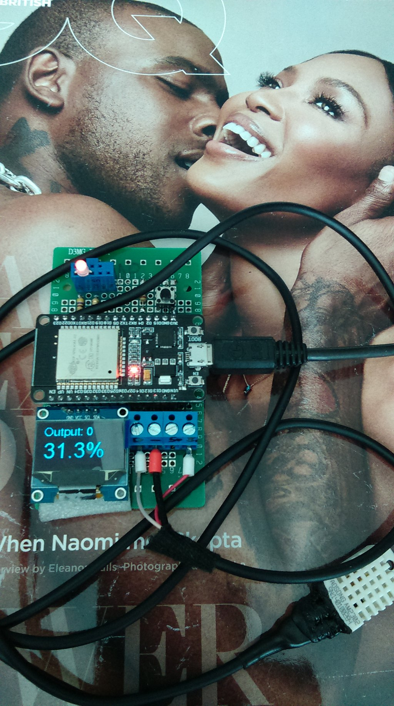

## Introduction

<table align="center">
    <tr>
    <th align="center"> ESP32 as MQTT Client</th>
    </tr>
    <tr>
    <td>
    
    </td>
    </tr>
</table>

I am working towards an ESP32 and MQTT based hobby communication device. It requires more research and stamina than I thought, so it is better 
to take this incrementally and report certain progress points. The plan:

- [x] DOIT DEVIT V1 ESP32-WROOM-32 with some extras (DHT22, SSD1306). 

- [x] MQTT server/broker, (mosquitto on Ubuntu, with Remmina if needed).

- [ ] Android MQTT client. Optional: Android MQTT clients and cloud brokers' free plans come and go.

- [ ] A double router setup.

- [x] Resilience/robustness w.r.t. a lost Wifi connection.

- [ ] Resilience/robustness w.r.t. a lost/restarting broker. Optional: mosquitto runs locally and is fairly robust.

- [ ] Coding the actual application. An example **mqtt_dht_sync_prod** shows broadcasting temperature and humidity with LED control, for now.


## Some Photos





The main appeal of the DOIT DEVIT V1 ESP32-WROOM-32 development board is that it is an inexpensive (sub 10-20$) board with an ambition to perform networking. At this point in time (2022), the board's RAM is still too tiny (we are left with tens of kilobytes after MicroPython and a few basic libs), and the recovery from the lost connection is still an ongoing research, but the device is already quite usable.

## Circuit Diagram

- [esp32-30pin] (the 30-pin variant of DOIT DEVIT V1 ESP32-WROOM-32, not 36).

- The DHT22 sensor whose data pin is connected to GPIO14.

- LED is connected to GPIO1.

- SSD1306 (optional). In-software I2C, adjust minihinch/color_setup.py accordingly:

  ```python
  if soft:
        pscl = machine.Pin(22, machine.Pin.OPEN_DRAIN)
        psda = machine.Pin(21, machine.Pin.OPEN_DRAIN)
        i2c = machine.SoftI2C(scl=pscl, sda=psda)
  ```

## Results So Far

- **minihinch**. Experiments with the dht22 sensor and SSD1306 display, adapting the codes by Peter Hinch. Both tests, sync and async work fine. 
  Networking works only half-way: The device sends the temperature and humidity data to the broker, but I am not able to set the LED value on 
  the ESP32 board remotely from the mosquitto client. Something is not right with the receiving message callback async stack, my code or the specific nightly 
  bin release I used to test the codes. Async also screws up printing in the repl, abandoning this for now. 
  This code might be useful for connecting the monitor SSD1306 and doing simple async stuff without interrupts which is kind of amazing, but 
  I do not recommend this path due to a tiny RAM.

- **minisantos_test**. This code is adapted from [the github repo by Rui Santos][micropython-Rui-Santos], and with it I am able to control the LED on ESP32 remotely 
  via MQTT. This proves that the network configuration parameters are correctly set. The sync/blocking way is fine, after a lost Wifi the device reboots 
  into the repl (no continuous operation with reconnection, just testing everything else).

- **minisantos_prod**. Same as **minisantos_test**, except that the device reconnects after a lost connection (tested it).

- **mqtt_dht_sync_test**. Same as **minisantos_test**, except that the device also measures the temperature and humidity values and sends it to the MQTT broker.

- **mqtt_dht_sync_prod**. Same as **minisantos_prod**, except that the device also measures the temperature and humidity values and sends it to the MQTT broker.


## MicroPython

- Ubuntu PC:

  ```console
  sudo apt-get install python3-pip
  sudo pip3 install esptool
  sudo pip3 install rshell
  ```

- USB connection:

  ```console
  ls /dev/ttyUSB*
  dmesg | grep ttyUSB
  ```

- Flashing/reflashing [MicroPython firmware][MicroPython firmware] (anew or after messing up **boot.py** and **main.py**):

  ```console
  esptool.py --port /dev/ttyUSB0 flash_id
  esptool.py --port /dev/ttyUSB0 erase_flash
  esptool.py --chip esp32 --port /dev/ttyUSB0 --baud 460800 write_flash -z 0x1000 esp32-ota-20220117-v1.18.bin
  ```

- Testing workflow:

  ```console
  cd mqtt_dht_sync_test
  rshell --buffer-size=30 -p /dev/ttyUSB0 -a
  boards
  ls /pyboard
  cp test_mqtt_dht_sync.py /pyboard
  cp umqttsimple.py /pyboard
  repl
  import test_mqtt_dht_sync
  ```
  
  Keep the device connected via USB. 
  

- Release: 

  ```console
  cd mqtt_dht_sync_prod
  rshell --buffer-size=30 -p /dev/ttyUSB0 -a
  boards
  ls /pyboard
  cp boot.py /pyboard
  cp main.py /pyboard
  cp umqttsimple.py /pyboard
  ```

  Disconnect the device from USB and use only a power supply.

## MQTT and Running the Whole Thing

1. Install the **mosquitto** broker and testing client:

    ```console
    sudo apt install mosquitto mosquitto-clients
    hostname -I
    ifconfig -a | grep inet
    ```

    The hostname/ifconfig command will provide the local MQTT broker IP address such as '192.168.1.107' which will have to be entered in the MicroPython 
    files manually/explicitly. 

2. Open the first terminal window, upload and run the MicroPython program either in the test or production mode, as described above.

3. Open the second one, start the MQTT Broker/Server

    ```console
    mosquitto
    [26443.515169]~DLT~13894~INFO     ~FIFO /tmp/dlt cannot be opened. Retrying later...
    1647721031: mosquitto version 1.6.9 starting
    1647721031: Using default config.
    1647721031: Opening ipv4 listen socket on port 1883.
    1647721031: Opening ipv6 listen socket on port 1883.
    1647721044: New connection from 192.168.1.107 on port 1883.
    1647721044: New client connected from 192.168.1.107 as mosq-Cza6hBSrWKTRDzhk1k (p2, c1, k60).
    1647721078: New connection from 192.168.1.100 on port 1883.

    ```

    If you get "Error: Address already in use" that means Ubuntu is already running its own MQTT broker process. Kill it via 
    
    ```console
    ps -ef | grep mosquitto
    sudo kill 12345
    ```
    
    Here "12345" is the mosquitto process ID shown by the ps command.

    The last line indicates the connected MicroPython MQTT client which gets a local IP address such as 192.168.1.100, 
    the latter may change with each device reboot.

4. Open the third terminal window. Start another MQTT client to read what MicroPython broadcasts:
  
  ```console
  mosquitto_sub -d -h 192.168.1.107 -t "testincr"
  Client mosq-Cza6hBSrWKTRDzhk1k sending CONNECT
  Client mosq-Cza6hBSrWKTRDzhk1k received CONNACK (0)
  Client mosq-Cza6hBSrWKTRDzhk1k sending SUBSCRIBE (Mid: 1, Topic: testincr, QoS: 0, Options: 0x00)
  Client mosq-Cza6hBSrWKTRDzhk1k received SUBACK
  Subscribed (mid: 1): 0
  Client mosq-Cza6hBSrWKTRDzhk1k received PUBLISH (d0, q0, r0, m0, 'testincr', ... (17 bytes))
  t=24.1C, h=26.5%.
  Client mosq-Cza6hBSrWKTRDzhk1k received PUBLISH (d0, q0, r0, m0, 'testincr', ... (17 bytes))
  t=24.2C, h=26.3%.
  ...
  ```

5. Open the fourth terminal window. Publish the messages "on" or "off" to control the LED output:

  ```console
  mosquitto_pub -d -h 192.168.1.107 -t "output" -m "on" -q 1
  Client mosq-o4Gn8fPBXKQnpGnixQ sending CONNECT
  Client mosq-o4Gn8fPBXKQnpGnixQ received CONNACK (0)
  Client mosq-o4Gn8fPBXKQnpGnixQ sending PUBLISH (d0, q1, r0, m1, 'output', ... (2 bytes))
  Client mosq-o4Gn8fPBXKQnpGnixQ received PUBACK (Mid: 1, RC:0)
  Client mosq-o4Gn8fPBXKQnpGnixQ sending DISCONNECT
  mosquitto_pub -d -h 192.168.1.107 -t "output" -m "off" -q 1
  Client mosq-sq8ZSnZedHg5RMTieT sending CONNECT
  Client mosq-sq8ZSnZedHg5RMTieT received CONNACK (0)
  Client mosq-sq8ZSnZedHg5RMTieT sending PUBLISH (d0, q1, r0, m1, 'output', ... (3 bytes))
  Client mosq-sq8ZSnZedHg5RMTieT received PUBACK (Mid: 1, RC:0)
  Client mosq-sq8ZSnZedHg5RMTieT sending DISCONNECT

  ```

  In order to broadcast periodically, one can run this modified Peter Hinch's bash file

  ```console
  #! /bin/bash
  while :
  do
      mosquitto_pub -d -h 192.168.1.107 -t "output" -m "on" -q 1
      sleep 30
      mosquitto_pub -d -h 192.168.1.107 -t "output" -m "off" -q 1
      sleep 30
  done
  ```

The async codes use artificial delays of up to 20s to react robustly to the broker's messages.


## SSD1306 Display 

I have adapted the [micropython-nano-gui][micropython-nano-gui] library for monochrome SSD1306 display, some bits of Peter Hinch's MIT-licensed code 
are simply copied here in order not to have the dependencies. **gui/core/colors.py** had a bug: All the occurences of "SSD" had to be changed to "ssd".

The pin configuration is in **color_setup.py** (which is basically the original micropython-nano-gui/setup_examples/ssd1306_pyb.py). When using I2C, only 
the two pins need to be specified: 

```python
use_spi = False
soft = True 
...
pscl = machine.Pin(22, machine.Pin.OPEN_DRAIN)
psda = machine.Pin(21, machine.Pin.OPEN_DRAIN)
```


## Some Observations, Problems

- An impressive chip and open source community, but still a long way towards reliability and convenience.

- MicroPython vs something static: I would go for static if I had a choice, but not Arduino/C++. They are all equally useless in the presence of the hardware 
 and communication errors. One may need to study additional networking tools.

- Consider an example: The DHT sensor is detached from the chip's pin. Executing the line "dht_sensor.measure()" or "dht_sensor.start()" 
  will reboot the device with a "useful" error message:

  ```console
  >>> import mainx
  ets Jun  8 2016 00:22:57

  rst:0x8 (TG1WDT_SYS_RESET),boot:0x13 (SPI_FAST_FLASH_BOOT)
  configsip: 0, SPIWP:0xee
  clk_drv:0x00,q_drv:0x00,d_drv:0x00,cs0_drv:0x00,hd_drv:0x00,wp_drv:0x00
  mode:DIO, clock div:2
  load:0x3fff0030,len:4540
  ho 0 tail 12 room 4
  load:0x40078000,len:12448
  load:0x40080400,len:4124
  entry 0x40080680
  W (57) boot.esp32: PRO CPU has been reset by WDT.
  W (58) boot.esp32: WDT reset info: PRO CPU PC=0x400803c0
  W (59) boot.esp32: WDT reset info: APP CPU PC=0x40093cb2
  MicroPython v1.17 on 2022-01-10; 4MB/OTA module with ESP32
  Type "help()" for more information.
  >>> 
  ```

- ESP12 has a pathetic amount of RAM, but ESP32 is no cake either. Importing the font arial35 from Peter Hinch's ssd1306 lib along with freesans20 
  is OK when running the DHT measurement with the display without the networking stack. Adding the async networking and the MQTT libs exposes an 
  insufficient RAM: "MemoryError: memory allocation failed, allocating 6632 bytes" (breaks at "#import gui.fonts.arial35 as arial35").

- Despite all the amazing work by Peter Hinch, I do not recommend using displays with ESP32 and the async codes. GUIs and ESP32 do not go hand in hand really: 
  Refresh issues, limited RAM... MQTT/repl is sufficient to read any complex information. Keep the device at "low level", use it just to build 
  the control and read/broadcast sensor measurements. Bail out to the PC space for everything else.

- Reconnection after losing Wifi seems to work (!), but more testing needs to be done w.r.t. very long runs (days and months).

- My great respect to the MicroPython community, esp. Peter Hinch and Rui and Sara Santos.

- TBC?!


## References

Essential:

- [Getting started]
- [MicroPython firmware]
- [micropython-Rui-Santos]
- [umqtt.simple]
- [esp32-30pin]

Optional:

- [micropython-mqtt-async]
- [micropython-nano-gui]
- [umqtt.robust]
- [umqtt.robust dies when MQTT broker gets restarted #102]
- [umqtt.simple socket behaviour when WiFi is degraded #103]
- [umqtt.robust: Resubscribe to topics after doing reconnect. #186]
- [can't await mqtt.simple publish method #357]
- [unstable MQTT on ESP8266 (4+ days) #2568]
- [umqtt cannot import MQTTClient #250]


[Getting Started]: https://www.youtube.com/watch?v=_vcQTyLU1WY&list=PLKGiH5V9SS1hUz5Jh_35oTFM4wPZYA4sT&index=2
[MicroPython firmware]: https://micropython.org/download/esp32-ota/
[micropython-mqtt-async]: https://github.com/peterhinch/micropython-mqtt/tree/master/mqtt_as
[micropython-nano-gui]: https://github.com/peterhinch/micropython-nano-gui
[micropython-Rui-Santos]: https://github.com/RuiSantosdotme/ESP-MicroPython/tree/master/code/MQTT/Node_RED_Client
[umqtt.simple]: https://github.com/micropython/micropython-lib/blob/master/micropython/umqtt.simple/example_sub_led.py
[esp32-30pin]:https://www.mischianti.org/wp-content/uploads/2020/11/ESP32-DOIT-DEV-KIT-v1-pinout-mischianti.png
[umqtt.robust]: https://github.com/micropython/micropython-lib/blob/master/micropython/umqtt.robust/example_sub_robust.py
[umqtt.robust dies when MQTT broker gets restarted #102]: https://github.com/micropython/micropython-lib/issues/102
[umqtt.robust: Resubscribe to topics after doing reconnect. #186]: https://github.com/micropython/micropython-lib/pull/186
[can't await mqtt.simple publish method #357]: https://github.com/micropython/micropython-lib/issues/357
[umqtt.simple socket behaviour when WiFi is degraded #103]: https://github.com/micropython/micropython-lib/issues/103
[unstable MQTT on ESP8266 (4+ days) #2568]: https://github.com/micropython/micropython/issues/2568
[umqtt cannot import MQTTClient #250]: https://github.com/micropython/micropython-lib/issues/250
