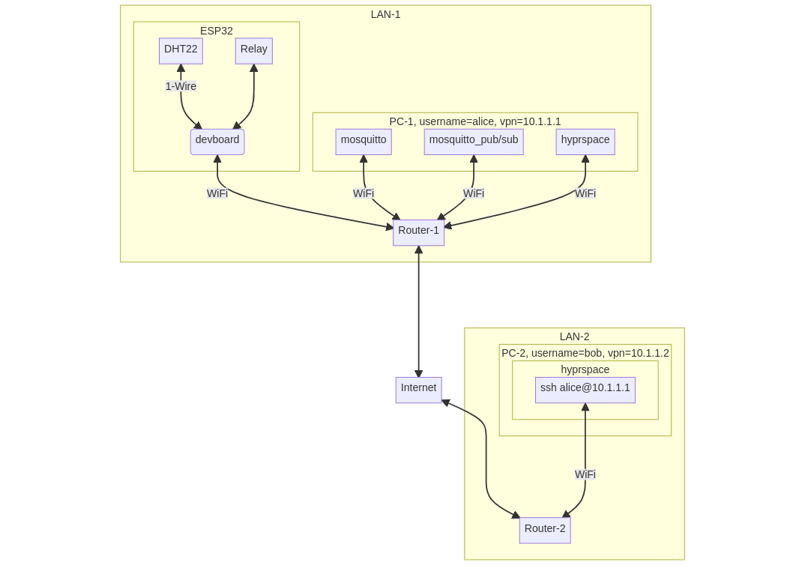
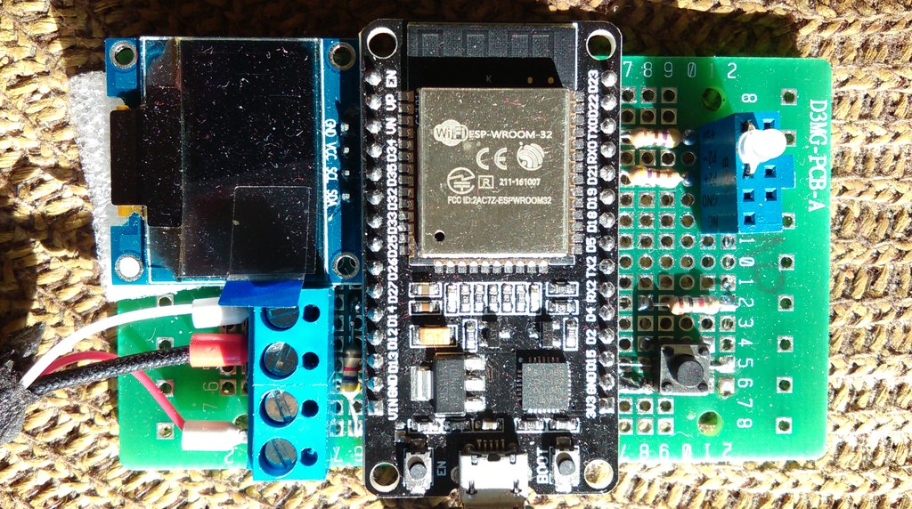
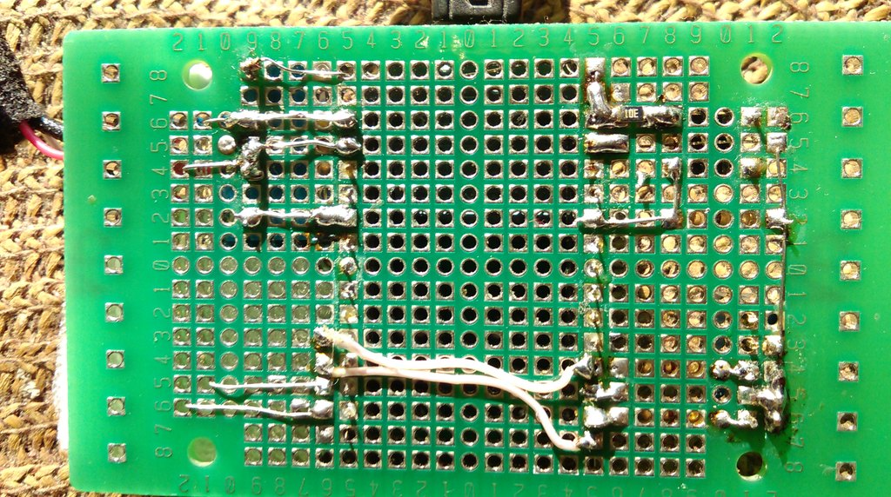

> “An operating system is a collection of things that don't fit into a language. <br>
There shouldn't be one.”<br> &ndash; Dan Ingalls


> “...the bullshit piled up so fast... you needed wings to stay above it.”<br> &ndash; Apocalypse Now, 1979

<table align="center">
    <tr>
    <th align="center"> ESP32 as an MQTT Client in the Context of IoT</th>
    </tr>
    <tr>
    <td>
    
    </td>
    </tr>
</table>

## Introduction

[DOIT DEvKit V1 ESP32-WROOM-32](https://en.wikipedia.org/wiki/ESP32) is an inexpensive (15 euro) microcontroller board with Wi-Fi, Bluetooth LE, and ESP-NOW. One can connect it to [a lot of sensors](https://esphome.io/#sensor-components) with ready-made drivers. The challenge is to control such a board globally, via the internet.

Initially, the goal was to use the ESP32 board for remote plant watering. This goal was achieved. However, we also found code-free solutions based on the Clas Ohlson WiFi Smart Plug which could be operated with their mobile app. The latter are cheap (10-20 euro) and easy to use, but one must rely on the Clas Ohlson servers. Smart plugs are limited: It is a one way communication from a mobile phone to an electrical relay via 3rd party servers.

Eventually this little project transformed into my personal research on global/remote connectivity, which I keep updating from time to time here. My ideal is reliable developer-friendly Linux-centric global communication.

## ESP32 and IoT

There are several ways to connect the ESP32 globally:

1. Cloud services: [ESP RainMaker](https://github.com/espressif/esp-rainmaker/issues/96), [Firebase](https://randomnerdtutorials.com/firebase-control-esp32-gpios/), [Blynk](https://blynk.io/blog/esp32-blynk-iot-platform-for-your-connected-product), [Arduino IoT Cloud](https://www.youtube.com/watch?v=rcCxGcRwCVk), [Yaler.net](https://yaler.net/), [Amazon API Gateway with Websocket API](https://www.youtube.com/watch?v=z53MkVFOnIo), [Amazon API Gateway with RESTful API](https://aws.amazon.com/blogs/compute/building-an-aws-iot-core-device-using-aws-serverless-and-an-esp32/), [Husarnet](https://husarnet.com/docs/tutorial-esp32-platformio), [CloudMQTT](https://www.cloudmqtt.com/blog/cloudmqtt-cute-cat-free-plan-out-of-stock.html), [HiveMQ](https://community.hivemq.com/t/connection-fail-in-hivemq-cloud/579/4), [RemoteXY](https://www.youtube.com/watch?v=dyEnOyQS1w8&t=1s), [Google Cloud IoT](https://www.elementzonline.com/blog/Connecting-ESP32-to-Google-Cloud-IoT), Viper/Zerynth: [1](https://zerynth.com/blog/python-on-esp32-getting-started/), [2](https://lemariva.com/blog/2021/12/zerynth-esp32-google-iot-core-part-1-sending-data-to-the-cloud), [3](https://zerynth.com/customers/case-studies/zerynth-powered-smart-iot-display/)... 

    Google IoT Core [will be discontinued on August 16, 2023](https://news.ycombinator.com/item?id=32475298). [Free plans come and go](https://twitter.com/heroku/status/1562817050565054469). Husarnet is the only one from the listed above which provides [its open source code](https://husarnet.com/business/open-source).
    
2. Classical web apps which will communicate with the ESP32 via the HTTP requests: [1](https://randomnerdtutorials.com/control-esp32-esp8266-gpios-from-anywhere/), [2](https://randomnerdtutorials.com/esp32-esp8266-mysql-database-php/). Notice that the board needs to know the URL or the IP address of the web app to send GET/POST requests, but the web app does not need to know the address of the board.

3. Something similar, but with the MQTT replacing the HTTP. Again, only the board needs to know the URL or the IP address of the "MQTT app". I prefer the MQTT for two reasons: (i) the MQTT client libs are more reliable than their HTTP counterparts in the ESP world, and (ii) there is no need to write a web app to send/receive data. One can simply run the Mosquitto broker as an "MQTT app" and use "mosquitto_pub/sub" commands w.r.t. the MQTT topics that the board will pub/sub to.

4. Connecting the ESP32 to the Linux PC over Wi-Fi that runs the MQTT broker within its LAN, thus delegating the problem of global connectivity effectively to the PC space.

The last option is my choice. It is the most reliable one, but it demands an extra PC/Linux board (PC-1 shown in the figure above). 

One can run the MQTT broker on a router, e.g. with [OpenWrt Linux](https://cgomesu.com/blog/Mesh-networking-openwrt-batman/): [1](https://www.onetransistor.eu/2019/05/run-local-mqtt-broker-on-openwrt-router.html), [2](https://esp8266.ru/esp8266-openwrt-mosquitto-mqttwarn-thingspeak-email-android-ios-twitter-cloudmqtt/) or [RutOS](https://teltonika-networks.com/lt/resursai/webinarai/rutos-an-extensive-introduction), but these router OSes (6-8MB .bin image size) are too limiting.

In order to establish remote PC connections, I have tested [Hyprspace](https://github.com/hyprspace/hyprspace/issues/94) and [EdgeVPN](https://github.com/mudler/edgevpn/issues/25). Both of them are FOSS (written in Go) based on the MIT-licensed stack called [go-libp2p](https://github.com/libp2p/go-libp2p). This stack provides [NAT](https://discuss.libp2p.io/t/how-nat-traversal-and-hole-punching-work-in-ipfs/1422) [traversal](https://github.com/ipfs/camp/blob/master/DEEP_DIVES/40-better-nat-traversal-so-that-relay-servers-are-a-last-not-first-resort.md) without external 3rd party or static IP. It is very useful for the ability to ssh into any remote computer!

Do these tools always work though, are they equally good? EdgeVPN may have an [edge](https://github.com/mudler/edgevpn/issues/25).

## Alternative Ways to Achieve Global Connectivity

EdgeVPN solves the problem of remote connections without a public IP/3rd party. However, the libp2p network is a relatively new (Web3) world with all sorts of pros and cons, e.g. the connections will not be the fastest possible. This hardly matters in the context of the ESP32, but I will bookmark here a few other options, something to think about:

- Renting any VPS with a public static IP and running WireGuard: [1](https://www.youtube.com/watch?v=5Aql0V-ta8A), [2](https://www.youtube.com/watch?v=_hiYI7ABnQI) or any of its alternatives with self-hosting: Nebula, Headscale, innernet, Tinc, [VpnCloud](https://vpncloud.ddswd.de/), [Outline VPN](https://www.youtube.com/watch?v=O9jGg6tE7nY)... The VpnCloud website is very educational, see e.g. [this VPN comparison](https://vpncloud.ddswd.de/features/comparison/).
    
    Outline VPN is based on [shadowsocks](https://www.quora.com/How-do-I-bypass-the-GFW-of-China-without-a-VPN), the tech used to bypass [the Great Firewall of China](https://en.wikipedia.org/wiki/Great_Firewall):

    "the developer of shadowsocksR being asked to police station,the code on github was deleted by unimagable mean. so v2ray come out in the world. Which is stronger than shadowsocks (or in another way v2ray contains shadowsocks),the establish method is same with shadowsocks.U can search 一键搭建v2ray on YouTube..."

- Tailscale and related CaaS: Defined Networking, NetBird, Netmaker, [ZeroTier](https://www.youtube.com/watch?v=sA55fcuJSQQ), [Hamachi](https://news.ycombinator.com/item?id=29479503), Tunnel In, [Cloudflare Tunnel](https://developers.cloudflare.com/cloudflare-one/connections/connect-apps/)...

- More (IoT/Raspberry Pi/Linux)-centric CaaS: ShellHub, RemoteIoT, DataPlicity, PiTunnel, SocketXP, NetFoundry: [1](https://netfoundry.io/edge-and-iot-zero-trust-networking/), [2](https://www.reddit.com/r/openziti/comments/xpe01b/need_some_guidance/)...

- Remmina, Chrome Remote Desktop, TeamViewer, AnyDesk, RustDesk, Screego... Remmina does not punch through CGNAT. Others are either paid services or rely on a static IP. "UbuntuDesk" with a free CGNAT punching, please.

- [Parsec, Rainway, Steam Remote Play](https://news.ycombinator.com/item?id=29479503) and other game streaming services might provide the most responsive VPNs.

- Wireguard on the ESP32: [1](https://github.com/ciniml/WireGuard-ESP32-Arduino), [2](https://github.com/trombik/esp_wireguard), [3](https://github.com/esphome/feature-requests/issues/1444). This is probably for some advanced optimistic uses where the ESP32 becomes an independent node on a par with Linux boards.

- The Onion Router: [1](https://www.maths.tcd.ie/~fionn/misc/ssh_hidden_service/), [2](https://www.techjail.net/raspberry-iotlinux-devices.html), [3](https://golb.hplar.ch/2019/01/expose-server-tor.html), [4](https://community.torproject.org/onion-services/setup/), [5](https://www.reddit.com/r/Freenet/comments/9w4do9/demo_public_darknet_on_the_tor_onioncat_ipv6/), [6](https://null-byte.wonderhowto.com/how-to/host-your-own-tor-hidden-service-with-custom-onion-address-0180159/), [7](https://opensource.com/article/19/8/how-create-vanity-tor-onion-address), [8](https://shufflingbytes.com/posts/ripping-off-professional-criminals-by-fermenting-onions-phishing-darknet-users-for-bitcoins/).
 
  "It's easier to setup a Tor hidden service than it is to set up a server with a domain. You don't have to know anything about DNS or firewalls. I'm surprised that they aren't more common."

- [Yggdrasil](https://news.ycombinator.com/item?id=27580995), [CJDNS](https://news.ycombinator.com/item?id=16135341)/Hyperboria, ZeroNet, I2P, Scuttlebutt and other global p2p networks. I have little initiative to try these networks out as the libp2p network (with EdgeVPN) solves the problem, but it is worth noting that p2p networks are ideal for low MQTT traffic, they are totally free to use and do not demand a public static IP. [This 2022 report](https://cheapskatesguide.org/articles/yggdrasil.html) delves deeper into Yggdrasil and provides some interesting details, e.g. the number of public peers in the US.

- [Freifunk, FunkFeuer, NYC Mesh](https://github.com/redecentralize/alternative-internet#networking) and other local community/city/country-wide radio p2p networks. [B.A.T.M.A.N.](https://en.wikipedia.org/wiki/B.A.T.M.A.N.) [routing](https://cgomesu.com/blog/Mesh-networking-openwrt-batman/) at the OSI layer 2 (Data link) rather than 3 (Network). [This will be relevant to the world after nuclear war](https://www.youtube.com/watch?v=DrXJ9_ezSy4). The free internet built with only "line of sight" devices, mostly routers with OpenWrt. Tools to mesh WLANs and LANs, BATMAN-based and traditional, with certain [use cases](https://youtu.be/t4A0kfg2olo?t=134).

- [Meshtastic](https://www.youtube.com/watch?v=TY6m6fS8bxU) is like Freifunk, but focused on LoRa. Its main use is in remote rural areas: Crowded rock festivals and related animal tracking. LoRa (LoRaWAN) alternatives include [NB-IoT, Sigfox, and Wi-Fi HaLow](https://www.hackster.io/news/the-ttgo-t-beam-an-esp32-lora-board-d44b08f18628).

- Phishing attacks to consider: [1](https://news.drweb.com/show/?i=14451), [2](https://www.reddit.com/r/crowdstrike/comments/tjh602/query_hunt_for_reverse_proxy_tunnel_tools/), [3](https://thestack.technology/ransomware-attack-bitlocker/), [4](https://www.trustwave.com/en-us/resources/blogs/spiderlabs-blog/ipfs-the-new-hotbed-of-phishing/), [5](https://shufflingbytes.com/posts/ripping-off-professional-criminals-by-fermenting-onions-phishing-darknet-users-for-bitcoins/)... Some tools built so you can attack your own IoT networks, for testing purposes: [1](https://github.com/ElectronicCats/CatSniffer), [2](https://github.com/SpacehuhnTech/esp8266_deauther), [3](https://www.youtube.com/watch?v=I0N2KpwGETI).

## Some Photos

This hobby/demo hardware has been assembled and soldered by Saulius Rakauskas (InfoVega).





## Circuit Diagram

- [esp32-30pin] (the 30-pin variant of DOIT DEVIT V1 ESP32-WROOM-32, not 36).

- DHT22, Multiple LEDs, Capacitive Soil Moisture Sensor v1.2, see boot.py.

- ~~SSD1306 with in-software I2C.~~ Dropped it, rewind to "the last before revamp" commit if interested.

## Commands

- Ubuntu PC:

  ```console
  sudo apt-get install python3-pip
  sudo pip3 install esptool
  sudo pip3 install rshell
  ```

- USB connection:

  ```console
  ls /dev/ttyUSB*
  dmesg | grep ttyUSB
  ```

- Flashing/reflashing [MicroPython firmware][MicroPython firmware] via USB:

  ```console
  sudo esptool.py --port /dev/ttyUSB0 flash_id
  sudo esptool.py --port /dev/ttyUSB0 erase_flash
  sudo esptool.py --chip esp32 --port /dev/ttyUSB0 --baud 460800 write_flash -z 0x1000 esp32-ota-20220618-v1.19.1.bin
  ```  

- Release: 

  ```console
  rshell --buffer-size=30 -p /dev/ttyUSB0 -a
  boards
  ls /pyboard
  cp main.py /pyboard
  cp umqttsimple.py /pyboard
  cp boot.py /pyboard
  ```

  Disconnect the device from USB and use only a power supply.

- MQTT:

  ```console
  sudo apt install mosquitto mosquitto-clients
  hostname -I
  ifconfig -a | grep inet
  ```

  The hostname/ifconfig command will provide the local IP address assigned by the router to a computer (PC-1) which runs the MQTT broker (Moscquitto), such as '192.168.1.107'. It will have to be entered in boot.py manually/explicitly. 


  The Mosquitto broker always runs on Ubuntu by default once the OS starts. However, depending on the exact Ubuntu and Mosquitto versions one may need some additional minimal configuration.
  Since Mosquitto version 2.0, one needs to create a custom config file and place it somewhere, say at /home/sara/esp32/custom_mosquitto.conf, with this minimal content:

  ```console
  listener 1883
  allow_anonymous true
  ```
  
  Then start the MQTT broker with this config:

  ```console
  mosquitto -c /home/sara/esp32/custom_mosquitto.conf
  ```

  Sometimes you may get "Error: Address already in use". That means you are starting another Mosquitto broker on the same machine. Kill one or the other with
    
  ```console
  ps -ef | grep mosquitto
  sudo kill 1234
  ```
    
  One should get the console message indicating the connected MicroPython MQTT client with its local IP address such as 192.168.1.108, the latter may change 
  with each device reboot, it is assigned by a router.

  Read the sensor data from the device:
 
  ```console
  mosquitto_sub -d -h 192.168.1.107 -t "testincr"
  ```

  Publish the messages "on" or "off" to control the LED output:

  ```console
  mosquitto_pub -d -h 192.168.1.107 -t "output" -m "on" -q 1
  mosquitto_pub -d -h 192.168.1.107 -t "output" -m "off" -q 1
  ```

- [EdgeVPN](https://github.com/mudler/edgevpn):

  Download the latest edgevpn executable for your OS, e.g. [edgevpn-v0.23.1-Linux-x86_64.tar.gz](https://github.com/mudler/edgevpn/releases/tag/v0.23.1). 
  
  Use the same release version on all the computers that will be connected into a VPN, otherwise there might be conflicts as some versions have changed the way the keys are stored and decoded.
  
  cd into extracted folder and generate config.yaml:
  
  ```console
  ./edgevpn -g > config.yaml
  ```

  Distribute it on all the machines that will be connected to EdgeVPN (manually by carrying a USB stick, via email, etc.).
  
  Assuming the machine runs Ubuntu, place the executable with config.yaml in the same folder and run
  
  ```console
  sudo IFACE=edgevpn0 ADDRESS=10.1.0.7/24 EDGEVPNCONFIG=config.yaml ./edgevpn --log-level debug
  ```
  
  The command assigns a virtual IP address 10.1.0.7 to the machine on which it is executed. Assign a different address to each machine that you connect to EdgeVPN, i.e. 10.1.0.1.. 10.1.0.254. but use the same config.yaml in each case.
  
  It may take several minutes for the node to join the EdgeVPN network which is the libp2p network under the hood. I do not recommend using the [Linux desktop GUI](https://github.com/mudler/edgevpn-gui) as it is totally unnecessary.
  
  If everything is fine, you should be able to connect to any Linux computer of your VPN, e.g.
  
  ```console
  ssh username@10.1.0.8
  username@10.1.0.8's password: 
  Last login: Mon Jul 10 15:13:34 2023 from 10.1.0.4
  
  ...
  
  exit
  logout
  Connection to 10.1.0.8 closed.
  ```
  
  The broker becomes visible as if the VPN were a LAN, so you can run mosquitto_pub/sub commands directly even without ssh-ing to the machine that runs the MQTT broker.
  
  When you are able to connect from A to B, A's ./edgevpn --log-level debug will show a lot of information including the following lines:
  
  ```
  {"level":"DEBUG","time":"2023-07-11T14:44:39.455+0300","caller":"discovery/dht.go:204","message":" Announcing ourselves..."}
  {"level":"DEBUG","time":"2023-07-11T14:44:56.542+0300","caller":"discovery/dht.go:207","message":" Successfully announced!"}
  {"level":"DEBUG","time":"2023-07-11T14:44:56.542+0300","caller":"discovery/dht.go:210","message":" Searching for other peers..."}
  {"level":"DEBUG","time":"2023-07-11T14:44:56.583+0300","caller":"discovery/dht.go:230","message":" Known peer (already connected):
  ```
  
  followed by the list of ip4 addresses of known/connected peers which will be global or local. While being on the A side, you should be able to see the local LAN address of B assigned to B by its encompassing router on the B side, remarkably. It should be in that ip4 list whose preamble I have just shown here.
  
## ESP32 and MicroPython

- **Hardware errors.** When the DHT sensor is detached from the chip's pin, executing the line "dht_sensor.measure()" or "dht_sensor.start()" 
  in the MicroPython REPL will reboot the device with a "useful" error message:

  ```console
  >>> import main
  ets Jun  8 2016 00:22:57

  rst:0x8 (TG1WDT_SYS_RESET),boot:0x13 (SPI_FAST_FLASH_BOOT)
  configsip: 0, SPIWP:0xee
  clk_drv:0x00,q_drv:0x00,d_drv:0x00,cs0_drv:0x00,hd_drv:0x00,wp_drv:0x00
  mode:DIO, clock div:2
  load:0x3fff0030,len:4540
  ho 0 tail 12 room 4
  load:0x40078000,len:12448
  load:0x40080400,len:4124
  entry 0x40080680
  W (57) boot.esp32: PRO CPU has been reset by WDT.
  W (58) boot.esp32: WDT reset info: PRO CPU PC=0x400803c0
  W (59) boot.esp32: WDT reset info: APP CPU PC=0x40093cb2
  MicroPython v1.17 on 2022-01-10; 4MB/OTA module with ESP32
  Type "help()" for more information.
  >>> 
  ```
- **Too little RAM.** ESP12e/ESP8266 has a [pathetic amount of RAM](https://github.com/espressif/esp-rainmaker/issues/8), but ESP32 is no cake either. Importing the font arial35 from Peter Hinch's ssd1306 lib along with freesans20 
  is still possible when running the DHT measurement with the display without the networking stack. Adding the async networking and the MQTT libs exposes an 
  insufficient RAM: 
  
  ```console
  "MemoryError: memory allocation failed, allocating 6632 bytes" (breaks at "#import gui.fonts.arial35 as arial35").
  ```
- **Low quality sensors**, see e.g. this [discussion](https://www.youtube.com/watch?v=IGP38bz-K48) of Capacitive Soil Moisture Sensor v1.2.
  The solutions based on the electrical resistance are worse due to a rapid corrosion of the electrodes. Contrary to some existing recommendations, submerging them into a cheap construction-site gypsum does not work as this kills their moisture sensitivity.
  
- Monitoring soil moisture is a much harder problem than sensing air humidity. Perhaps the best way is to set up a camera and observe the ground surface. It is doubtful whether the ESP32 could be a good platform for capturing and sending images.     
  
- Despite all the amazing work by Peter Hinch, I could not make the async codes receive my MQTT messages, the device could only send them.

- After a long search and disappointment I could finally reach resilience w.r.t. the Wi-Fi loss thanks to this [code by Rui and Sara Santos][micropython-Rui-Santos].
  
## Conclusions

ESP32

- DOIT DEvKit V1 ESP32-WROOM-32 is roughly an ATmega board, only with a longer reach to its sensors, plus a lot of convenience (e.g. MicroPython), minus economy and reliability. The [ESP32](https://en.wikipedia.org/wiki/ESP32) is much better than sending UDP packets with [Atmega and the ENC28J60](http://tuxgraphics.org/electronics/200606/article06061.shtml). However, tiny RAM = yet another custom tech stack, which is so unnecessary in the year 2023. I would not use the ESP32 for anything other than transmitting sensor values/control within a LAN. Bail out to the Linux space ASAP.
  
- The [ESP32](https://en.wikipedia.org/wiki/ESP32) niche could be massive LANs of "Wi-Fi-enabled" sensors, where node failures are not critical, e.g. [waste bin level sensors](https://www.ecubelabs.com/bin-level-sensors-5-reasons-why-every-city-should-track-their-waste-bins-remotely/). Contrary to popular belief, these chips are very suboptimal for hobby networking, compared to, say, Raspberry Pi Zero W. I would look more into the [ESP32-ready sensors](https://esphome.io/#sensor-components) and think of distributing them in the LAN.

- Consider economics: DOIT DEVIT V1 ESP32-WROOM-32 vs Raspberry Pi Zero W bought on, say, anodas.lt in Vilnius, May 23rd, 2023. The former costs 12.70€, while the latter is 23.90€ plus a 32GB MicroSD card sold as low as 4.90€. A typical hobbyist will only need a dozen of such devices in a life time, and the cost of 2-4x higher priced Raspberry Pi Zero W will be negligible compared to the pain one will experience with scarce network software and tiny kilobyte RAM of ESP32. [Andreas Spiess](https://www.youtube.com/watch?v=rXc_zGRYhLo&t=389s) even suggests getting an old used laptop on ebay instead of a new Raspberry Pi.  

- A bus card reader? We used to have some early low RAM devices here in Vilnius for about 5-10 years. They would produce occasional errors and that is how I know that their memory was kilobytes, it would be displayed in the error message on the screen. This year (2023) the bus card readers got replaced with Estonian Ridango devices which, I suspect, run Linux. 

- The [ESP32](https://en.wikipedia.org/wiki/ESP32) provides small distance communication via the BLE and ESP-NOW protocols. In theory, this could be used to implement electronic bike shifting, remove low power electric control wires whenever possible. "But hold on a second, did you know that you never need to update the firmware on a mechanical derailleur?" 

- The combo of the [ESP32](https://en.wikipedia.org/wiki/ESP32) and MicroPython achieves hassle-free ADC and easy ROM address scanning (whenever one needs to pin a lot of temperature sensors on a single wire input). This is a lot messier in the ATmega world. There is no need to deal with the fuse bits, makefiles and C shenanigans. This brings convenience, but MicroPython wastes RAM and dynamic typing is very prone to typos and all sorts of hidden bugs, which is a huge problem.

- Wi-Fi is limited to 10...50m without repeaters. [LoRa](https://en.wikipedia.org/wiki/LoRa) (e.g. [LILYGO TTGO T-Beam ESP32 board](https://www.youtube.com/watch?v=TY6m6fS8bxU)) may reach [1...166km](https://meshtastic.discourse.group/t/practical-range-test-results/692/47?page=2). The ESP32 could be suboptimal w.r.t. its power consumption, which is critical in [mobile p2p radio networks](https://meshtastic.discourse.group/t/real-world-use-cases/175).

- Useful ESP32 applications may not require global connectivity (see e.g. this router: [1](https://github.com/martin-ger/esp32_nat_router/tree/master), [2](https://github.com/dchristl/esp32_nat_router_extended/tree/master/src)), or even local connectivity (see e.g. [the GPS Tracker](https://how2electronics.com/esp32-gps-tracker-using-l86-gps-module-oled-display/)). The [ESP32](https://www.youtube.com/@ESP32WiPhone/videos) [WiPhone](https://news.ycombinator.com/item?id=32762767)?

- This is where ESP32 shines perhaps, i.e. quick prototyping for early research:

    [Real Time IOT based Non-invasive Glucobin Monitor for Diabetes
    Patients, by Azra Anjum, Mythri, and Dr. Niranjan K., 2021](https://ijrpr.com/uploads/V2ISSUE9/IJRPR1274.pdf)

    The paper uses the ESP32 with the Near Infrared (NIR) sensor (940nm wavelength) to monitor blood glucose levels.
    
    Some researchers cobble up cheap magnetic field sensors in mechanics studies before investing in expensive ones.

Global Connectivity

- All this gigantic CaaS/VPN activity exists mostly because A and B do not have proper addresses. We cannot use MAC, we do not have the IPv6. So how does one send a message? Go study OSI and the seven dwarfs, TCP meltdown, overlay mesh networks, proxies and reverse proxies, [tunneling and self-hosting](https://github.com/anderspitman/awesome-tunneling), STUN/TURN/ICE, CGNAT, ARP, ICMP, mDNS, subnet masks, gateways, port forwarding, Linux kernel routes, CIDR, hosts, DHCP, interfaces, firewalls, routers... [B.A.T.M.A.N.](https://en.wikipedia.org/wiki/B.A.T.M.A.N.)  

- [EdgeVPN](https://github.com/mudler/edgevpn/issues/25) is a remarkable FOSS VPN which could be used to ssh globally to any computer behind CGNAT without any 3rd party service and static IP. The connection may be slow, but it is free and works as long as the libp2p network has any connected peers. According to [Max Inden, 2022](https://archive.fosdem.org/2022/schedule/event/libp2p/attachments/audio/4917/export/events/attachments/libp2p/audio/4917/slides.pdf), the libp2p network "powers the IPFS, Ethereum 2, Filecoin and Polkadot network and there are ~100K libp2p based nodes online at any given time".

- So we do connect A and B, but there is no 100% guarantee. [More like 50% - 80%](https://www.youtube.com/watch?v=bzL7Y1wYth8). The complexity is staggering. [EdgeVPN](https://github.com/mudler/edgevpn): 7.5 KLOC of Go plus [go-libp2p](https://github.com/libp2p/go-libp2p) which is another 67 KLOC of Go (!) that implement a fairly tricky hole punching p2p system. [wireguard-go](https://github.com/WireGuard/wireguard-go): 13 KLOC. All this effort just to give your hardware a proper/virtual IP address.

- Wireguard can run on the ESP32, but EdgeVPN runs only on [big common OSes](https://github.com/mudler/edgevpn/releases/tag/v0.23.1). The edgevpn executable on Linux is 34MB. In the logs of my runs I also see at least 2MB UDP buffer sizes requested for the UDP inside [QUIC](https://github.com/quic-go/quic-go/wiki/UDP-Buffer-Sizes). See [a complete list of protocols used by the libp2p](https://github.com/libp2p/specs). 

    It is unlikely that applications such as EdgeVPN will ever get ported to the ESP32 and similar tiny RAM IoT. These devices are better paired with a Linux board. See [this LoRa for libp2p example](https://github.com/RTradeLtd/libp2p-lora-transport) which first connects the LoRa shield bridge to ATmega2560 and then uses the serial interface to bail out to Linux for the libp2p part. 

## References

The ESP32 Essentials:

- [MicroPython firmware]
- [micropython-Rui-Santos]
- [umqtt.simple]
- [esp32-30pin]

Optional (problems to be aware of):

- [micropython-mqtt-async]
- [micropython-nano-gui]
- [umqtt.robust]
- [umqtt.robust dies when MQTT broker gets restarted #102]
- [umqtt.simple socket behaviour when WiFi is degraded #103]
- [umqtt.robust: Resubscribe to topics after doing reconnect. #186]
- [can't await mqtt.simple publish method #357]
- [unstable MQTT on ESP8266 (4+ days) #2568]
- [umqtt cannot import MQTTClient #250]

"All your stupid ideals <br> 
  You've got your head in the clouds" <br> 
  &#8211; [Depeche Mode - Useless](https://www.youtube.com/watch?v=U2Kyu4XURaE) 


[Getting Started]: https://www.youtube.com/watch?v=_vcQTyLU1WY&list=PLKGiH5V9SS1hUz5Jh_35oTFM4wPZYA4sT&index=2
[MicroPython firmware]: https://micropython.org/download/esp32-ota/
[micropython-mqtt-async]: https://github.com/peterhinch/micropython-mqtt/tree/master/mqtt_as
[micropython-nano-gui]: https://github.com/peterhinch/micropython-nano-gui
[micropython-Rui-Santos]: https://github.com/RuiSantosdotme/ESP-MicroPython/tree/master/code/MQTT/Node_RED_Client
[umqtt.simple]: https://github.com/micropython/micropython-lib/blob/master/micropython/umqtt.simple/example_sub_led.py
[esp32-30pin]:https://www.mischianti.org/wp-content/uploads/2020/11/ESP32-DOIT-DEV-KIT-v1-pinout-mischianti.png
[umqtt.robust]: https://github.com/micropython/micropython-lib/blob/master/micropython/umqtt.robust/example_sub_robust.py
[umqtt.robust dies when MQTT broker gets restarted #102]: https://github.com/micropython/micropython-lib/issues/102
[umqtt.robust: Resubscribe to topics after doing reconnect. #186]: https://github.com/micropython/micropython-lib/pull/186
[can't await mqtt.simple publish method #357]: https://github.com/micropython/micropython-lib/issues/357
[umqtt.simple socket behaviour when WiFi is degraded #103]: https://github.com/micropython/micropython-lib/issues/103
[unstable MQTT on ESP8266 (4+ days) #2568]: https://github.com/micropython/micropython/issues/2568
[umqtt cannot import MQTTClient #250]: https://github.com/micropython/micropython-lib/issues/250
