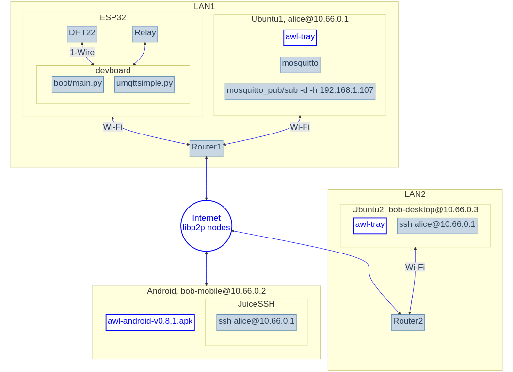

> “...the bullshit piled up so fast... you needed wings to stay above it.”<br> &ndash; Apocalypse Now, 1979

<table align="center">
    <tr>
    <th align="center"> Towards Reliable IoT</th>
    </tr>
    <tr>
    <td>
    
    </td>
    </tr>
</table>

## Introduction

[DOIT DEvKit V1 ESP32-WROOM-32](https://en.wikipedia.org/wiki/ESP32) is an inexpensive (15€) microcontroller board with Wi-Fi, Bluetooth LE, and ESP-NOW. One can connect it to [various sensors](https://esphome.io/#sensor-components) with ready-made drivers. The challenge is to control such a board globally, via the internet.

<table align="center">
    <tr>
    <th align="center">The Premise</th>
    </tr>
    <tr>
    <td>
    
    </td>
    </tr>
</table>

## ESP32 and IoT

There are several ways to make the ESP32 visible globally:

1. Cloud services: [ESP RainMaker](https://github.com/espressif/esp-rainmaker/issues/96), [Firebase](https://randomnerdtutorials.com/firebase-control-esp32-gpios/), [Blynk](https://blynk.io/blog/esp32-blynk-iot-platform-for-your-connected-product), [Arduino IoT Cloud](https://www.youtube.com/watch?v=rcCxGcRwCVk), [Yaler.net](https://yaler.net/), [Amazon API Gateway with Websocket API](https://www.youtube.com/watch?v=z53MkVFOnIo), [Amazon API Gateway with RESTful API](https://aws.amazon.com/blogs/compute/building-an-aws-iot-core-device-using-aws-serverless-and-an-esp32/), [Husarnet](https://husarnet.com/docs/tutorial-esp32-platformio), [CloudMQTT](https://www.cloudmqtt.com/blog/cloudmqtt-cute-cat-free-plan-out-of-stock.html), [HiveMQ](https://community.hivemq.com/t/connection-fail-in-hivemq-cloud/579/4), [RemoteXY](https://www.youtube.com/watch?v=dyEnOyQS1w8&t=1s), [Google Cloud IoT](https://www.elementzonline.com/blog/Connecting-ESP32-to-Google-Cloud-IoT), Viper/Zerynth: [1](https://zerynth.com/blog/python-on-esp32-getting-started/), [2](https://lemariva.com/blog/2021/12/zerynth-esp32-google-iot-core-part-1-sending-data-to-the-cloud), [3](https://zerynth.com/customers/case-studies/zerynth-powered-smart-iot-display/), [Tuya IoT Development Platform](https://www.hackster.io/vilaksh01/tuya-mqtt-with-esp32-434ad6), Thingschain: [1](https://docs.thingschain.net/apps/esphome), [2](https://www.linkedin.com/pulse/decentralized-technology-tokens-designed-internet-things-bhatia/), Azure IoT: [1](https://learn.microsoft.com/en-us/azure/iot-develop/quickstart-devkit-espressif-esp32-freertos), [2](https://www.espressif.com/products/devkits/esp32-azure-kit/overview), [ZeroTier?](https://github.com/zerotier/ZeroTierOne/issues/668), Notehub: [1](https://blues.io/products/notehub/), [2](https://blues.io/blog/easiest-cellular-iot-esp32/), [ngrok](https://ngrok.com/blog-post/putting-the-esp32-microcontroller-on-the-internet)... 

    Google IoT Core [was discontinued on August 16, 2023](https://news.ycombinator.com/item?id=32475298). [Free plans come and go](https://twitter.com/heroku/status/1562817050565054469). Husarnet is the only one from the listed above which provides [its open source code](https://husarnet.com/business/open-source).
    
2. An HTTP web app: [1](https://randomnerdtutorials.com/control-esp32-esp8266-gpios-from-anywhere/), [2](https://randomnerdtutorials.com/esp32-esp8266-mysql-database-php/). The board needs to know the URL or the IP address of the app to send GET/POST requests, but the app does not need to know the address of the board.

3. [A similar MQTT intermediary](https://habr.com/ru/articles/504716/) which could just be the SSH tunnel from your local MQTT broker to a rented VPS. The MQTT has its [pros and cons](https://news.ycombinator.com/item?id=34171406). Subjectively, (i) the MQTT is more reliable than the HTTP in the ESP world, and (ii) there is no need to write a web app to send/receive data (although the same may hold for the HTTP). One can simply run the tunnelled Mosquitto broker as an "MQTT app" on the VPS, and issue "mosquitto_pub/sub" commands w.r.t. the MQTT topics that the board will pub/sub to.

4. [Wireguard](https://blog.thestaticturtle.fr/lets-talk-about-wireguard/) on the ESP32: [0](https://news.ycombinator.com/item?id=34171406), [1](https://github.com/ciniml/WireGuard-ESP32-Arduino/issues), [2](https://github.com/trombik/esp_wireguard/issues), [3](https://github.com/droscy/esp_wireguard), [4](https://github.com/esphome/feature-requests/issues/1444), [5](https://www.reddit.com/r/esp32/comments/110f2ey/esp32_ap_tunneling_all_devices_to_my_vpn_server/), [6](https://techoverflow.net/2021/12/31/esp32-wireguard-example-with-http-access-over-wireguard-platformio/). This is for some overly optimistic dubious uses where the ESP32 becomes a VPN node on a par with Linux boards. No MicroPython support, no ssh, a tiny fractured [LwIP](https://forum.micropython.org/viewtopic.php?t=7569) networking user base. Wireguard still needs a public static IP.

5. Connecting the ESP32 over Wi-Fi to the Linux PC, which runs the MQTT broker on its LAN, thus delegates the problem of global connectivity to the PC.

The last option is our choice here. It is the most reliable as the ESP32 communicates only within its LAN. We do not need to hunt for the reviews of all these clouds and make tough choices. When things go wrong, we can locate the problem easier since the global connectivity happens only in the Linux space. We do not need to deal with opaque evolving 3rd party services, vendor lock-in, opaque firmware/software on the ESP32, we can add as many devices as we want, run MicroPython, there are no subscription payments. The downside is that this demands running 24/7 an extra PC/Linux board (Ubuntu1 shown in the figure above). Many out-of-the-box Android conveniences offered by, say, ESP RainMaker Cloud will not be present: a simple push button/dash board Android app, Wi-Fi provisioning, device discoverability, OTA updates. However, we can control the ESP32 globally from Android via the Linux intermediary and go-libp2p.

One can run an MQTT broker on a router, e.g. with [OpenWrt Linux](https://cgomesu.com/blog/Mesh-networking-openwrt-batman/): [1](https://www.onetransistor.eu/2019/05/run-local-mqtt-broker-on-openwrt-router.html), [2](https://esp8266.ru/esp8266-openwrt-mosquitto-mqttwarn-thingspeak-email-android-ios-twitter-cloudmqtt/) or [RutOS](https://teltonika-networks.com/lt/resursai/webinarai/rutos-an-extensive-introduction), but these router OSes (6-8MB .bin image size) are too limiting. More importantly, one cannot use go-libp2p with them.

In order to establish remote PC connections, we have tested [Hyprspace](https://github.com/hyprspace/hyprspace/issues/94), [EdgeVPN](https://github.com/mudler/edgevpn/issues/25), and [anywherelan (awl)](https://github.com/anywherelan/awl). All of them are built on top of [go-libp2p](https://github.com/libp2p/go-libp2p) which is both, the FOSS code, and the running network with [NAT](https://discuss.libp2p.io/t/how-nat-traversal-and-hole-punching-work-in-ipfs/1422) [traversal](https://github.com/ipfs/camp/blob/master/DEEP_DIVES/40-better-nat-traversal-so-that-relay-servers-are-a-last-not-first-resort.md) aka hole punching. This software allows to ssh into a remote computer without a public static IP.

According to [Max Inden, 2022](https://archive.fosdem.org/2022/schedule/event/libp2p/attachments/audio/4917/export/events/attachments/libp2p/audio/4917/slides.pdf), the libp2p network "powers the IPFS, [Ethereum 2](https://blog.libp2p.io/libp2p-and-ethereum/#how-ethereum-beacon-nodes-use-libp2p-%F0%9F%94%8D), Filecoin and Polkadot network and there are ~100K libp2p based nodes online at any given time".

Do these tools always work though, are they equally good? 

  [hyprspace](https://github.com/hyprspace/hyprspace): 895 LOC of Go. Minimal, but weaker hole punching.
  
  [awl](https://github.com/anywherelan/awl): 6.5 KLOC of Go. Just about right.
  
  [EdgeVPN](https://github.com/mudler/edgevpn): 7.5 KLOC of Go. Solid punching, but problems with 24/7 runs. No Android support. 

  [go-libp2p](https://github.com/libp2p/go-libp2p): 67 KLOC of Go. The base layer for the three above.

EdgeVPN may have an [edge](https://github.com/mudler/edgevpn/issues/25) over Hyprspace, but there is [a problem with longer runs](https://github.com/mudler/edgevpn/issues/137). [awl](https://github.com/anywherelan/awl) is more reliable. It is also more convenient (desktop browser GUI for one-click handshakes, runs on Android), but not always. If for some reason one has to reinstall the Android app, the latter generates a new peer id which then needs to be confirmed again on the other end. EdgeVPN simply shares the same secret file and has no handshakes.

## Some Photos

This hobby/demo hardware has been assembled and soldered by Saulius Rakauskas (InfoVega).


## Circuit Diagram

- [esp32-30pin] (the 30-pin variant of DOIT DEVIT V1 ESP32-WROOM-32, not 36).

- DHT22, Multiple LEDs, Capacitive Soil Moisture Sensor v1.2, see boot.py.

- ~~SSD1306 with in-software I2C.~~ Dropped it, rewind to "the last before revamp" commit if interested.

## Commands

- Ubuntu PC:

  ```console
  sudo apt-get install python3-pip
  sudo pip3 install esptool
  sudo pip3 install rshell
  ```

- USB connection:

  ```console
  ls /dev/ttyUSB*
  dmesg | grep ttyUSB
  ```

- Flashing/reflashing [MicroPython firmware][MicroPython firmware] via USB:

  ```console
  sudo esptool.py --port /dev/ttyUSB0 flash_id
  sudo esptool.py --port /dev/ttyUSB0 erase_flash
  sudo esptool.py --chip esp32 --port /dev/ttyUSB0 --baud 460800 write_flash -z 0x1000 esp32-ota-20220618-v1.19.1.bin
  ```  

- Release: 

  ```console
  rshell --buffer-size=30 -p /dev/ttyUSB0 -a
  boards
  ls /pyboard
  cp main.py /pyboard
  cp umqttsimple.py /pyboard
  cp boot.py /pyboard
  ```

  Disconnect the device from USB and use only a power supply.

- MQTT:

  ```console
  sudo apt install mosquitto mosquitto-clients
  hostname -I
  ifconfig -a | grep inet
  ```

  The hostname/ifconfig command will provide the local IP address assigned by the router to a computer (PC-1) which runs the MQTT broker (Moscquitto), such as '192.168.1.107'. It will have to be entered in boot.py manually/explicitly. 


  The Mosquitto broker always runs on Ubuntu by default once the OS starts. However, depending on the exact Ubuntu and Mosquitto versions one may need some additional minimal configuration.
  Since Mosquitto version 2.0, one needs to create a custom config file and place it somewhere, say at /home/sara/esp32/custom_mosquitto.conf, with this minimal content:

  ```console
  listener 1883
  allow_anonymous true
  ```
  
  Then start the MQTT broker with this config:

  ```console
  mosquitto -c /home/sara/esp32/custom_mosquitto.conf
  ```

  Sometimes you may get "Error: Address already in use". That means you are starting another Mosquitto broker on the same machine. Kill one or the other with
    
  ```console
  ps -ef | grep mosquitto
  sudo kill 1234
  ```
    
  One should get the console message indicating the connected MicroPython MQTT client with its local IP address such as 192.168.1.108, the latter may change 
  with each device reboot, it is assigned by a router.

  Read the sensor data from the device:
 
  ```console
  mosquitto_sub -d -h 192.168.1.107 -t "testincr"
  ```

  Publish the messages "on" or "off" to control the LED output:

  ```console
  mosquitto_pub -d -h 192.168.1.107 -t "output" -m "on" -q 1
  mosquitto_pub -d -h 192.168.1.107 -t "output" -m "off" -q 1
  ```

- EdgeVPN:

  Download the latest edgevpn executable for your OS, e.g. [edgevpn-v0.23.1-Linux-x86_64.tar.gz](https://github.com/mudler/edgevpn/releases/tag/v0.23.1). 
  
  Use the same release version on all the computers that will be connected into a VPN, otherwise there might be conflicts as some versions have changed the way the keys are stored and decoded.
  
  cd into extracted folder and generate config.yaml:
  
  ```console
  ./edgevpn -g > config.yaml
  ```

  Distribute it on all the machines that will be connected to EdgeVPN (manually by carrying a USB stick, via email, etc.).
  
  Assuming the machine runs Ubuntu, place the executable with config.yaml in the same folder and run
  
  ```console
  sudo IFACE=edgevpn0 ADDRESS=10.1.0.7/24 EDGEVPNCONFIG=config.yaml ./edgevpn --log-level debug
  ```
  
  The command assigns a virtual IP address 10.1.0.7 to the machine on which it is executed. Assign a different address to each machine that you connect to EdgeVPN, i.e. 10.1.0.1.. 10.1.0.254. but use the same config.yaml in each case.
  
  It may take several minutes for the node to join the EdgeVPN network which is the libp2p network under the hood. [The Linux desktop GUI](https://github.com/mudler/edgevpn-gui) is totally unnecessary.
  
  If everything is fine, you should be able to connect to any Linux computer of your VPN, e.g.
  
  ```console
  ssh username@10.1.0.8
  username@10.1.0.8's password: 
  Last login: Mon Jul 10 15:13:34 2023 from 10.1.0.4
  
  ...
  
  exit
  logout
  Connection to 10.1.0.8 closed.
  ```
    
  When you are able to connect from A to B, A's ./edgevpn --log-level debug will show a lot of information including the following lines:
  
  ```
  {"level":"DEBUG","time":"2023-07-11T14:44:39.455+0300","caller":"discovery/dht.go:204","message":" Announcing ourselves..."}
  {"level":"DEBUG","time":"2023-07-11T14:44:56.542+0300","caller":"discovery/dht.go:207","message":" Successfully announced!"}
  {"level":"DEBUG","time":"2023-07-11T14:44:56.542+0300","caller":"discovery/dht.go:210","message":" Searching for other peers..."}
  {"level":"DEBUG","time":"2023-07-11T14:44:56.583+0300","caller":"discovery/dht.go:230","message":" Known peer (already connected):
  ```
  
  followed by the list of so called multiaddresses of known/connected peers which will include global or local IPv4. While being on the A side, you should be able to see the local LAN IPv4 address of B assigned to B by its encompassing router on the B side!
  
- awl:
  
  There is [one unsolved issue](https://github.com/mudler/edgevpn/issues/137) with edgevpn that occurs on the 24/7 runs, so we switched to [awl](https://github.com/anywherelan/awl) which seems to be more reliable. 
  
  Download the [awl-tray binary](https://github.com/anywherelan/awl/releases) and run it, see [1](https://github.com/anywherelan/awl#desktopandroid) and [2](https://github.com/anywherelan/awl#desktop-awl-tray) for more details.
  
  awl is nice in that once you start it on Android, you can then run an SSH app such as [JuiceSSH](https://play.google.com/store/apps/details?id=com.sonelli.juicessh&hl=en&gl=US) and get the remote access to your Linux terminal. Make sure the awl VPN has no overlapping/duplicated addresses and delete all the previous connections on JuiceSSH before connecting. awl is not very polished yet so one can sometimes mess up virtual addresses with many-to-one connections and loops.
   
## ESP32 and MicroPython

- **Hardware errors.** When the DHT sensor is detached from the chip's pin, executing the line "dht_sensor.measure()" or "dht_sensor.start()" 
  in the MicroPython REPL will reboot the device with a "useful" error message:

  ```console
  >>> import main
  ets Jun  8 2016 00:22:57

  rst:0x8 (TG1WDT_SYS_RESET),boot:0x13 (SPI_FAST_FLASH_BOOT)
  configsip: 0, SPIWP:0xee
  clk_drv:0x00,q_drv:0x00,d_drv:0x00,cs0_drv:0x00,hd_drv:0x00,wp_drv:0x00
  mode:DIO, clock div:2
  load:0x3fff0030,len:4540
  ho 0 tail 12 room 4
  load:0x40078000,len:12448
  load:0x40080400,len:4124
  entry 0x40080680
  W (57) boot.esp32: PRO CPU has been reset by WDT.
  W (58) boot.esp32: WDT reset info: PRO CPU PC=0x400803c0
  W (59) boot.esp32: WDT reset info: APP CPU PC=0x40093cb2
  MicroPython v1.17 on 2022-01-10; 4MB/OTA module with ESP32
  Type "help()" for more information.
  >>> 
  ```
- **Too little RAM.** ESP12e/ESP8266 has a [pathetic amount of RAM](https://github.com/espressif/esp-rainmaker/issues/8), but ESP32 is no cake either. Importing the font arial35 from Peter Hinch's ssd1306 lib along with freesans20 
  is still possible when running the DHT measurement with the display without the networking stack. Adding the async networking and the MQTT libs exposes insufficient RAM: 
  
  ```console
  "MemoryError: memory allocation failed, allocating 6632 bytes" (breaks at "#import gui.fonts.arial35 as arial35").
  ```
- **Low quality sensors**, see this [discussion](https://www.youtube.com/watch?v=IGP38bz-K48) of Capacitive Soil Moisture Sensor v1.2.
  The solutions based on the electrical resistance are worse due to rapid corrosion of electrodes. We have tried submerging them into a cheap industrial gypsum, but that did not work at all.
  
- Monitoring soil moisture is a harder problem than sensing air humidity. Perhaps the best way is to set up a camera and somehow infer soil moisture from the ground image, but it is not clear if the ESP32 platform is ideal for image capture/processing due to limited resolution: ~~[320x240@25FPS](https://github.com/cspwcspw/ESP32_CamToLCD)~~ [15fps@1600×1200, 30fps@SVGA, 60fps@CIF](https://www.arducam.com/arducam-ov2640-camera-module-2mp-mini-ccm-compact-camera-modules-compatible-with-arduino_m0031esp32-esp8266-development-board-with-dvp-24-pin-interface_.html). Seeed Studio XIAO ESP32 S3 Sense is an ESP32 board with an integrated OV2640 camera which even has an NPU (Neural Processing Unit). See [what's so special about ESP cam?](https://www.reddit.com/r/esp32/comments/1h5m8vf/whats_so_special_about_esp_cam/) with a link to the code of [toy astrophotography](https://github.com/paoloinverse/CameraWebServerRecordeR_AstroEdition).   
  
- Despite the amazing async MQTT lib by Peter Hinch, the device could only send the MQTT messages, the receiving did not work. So we went back to umqttsimple.

- After a long search and disappointment the resilience w.r.t. the Wi-Fi loss was reached thanks to this [code by Rui and Sara Santos][micropython-Rui-Santos].
  
## Notes

- Tiny ESP32 RAM = very limited software, esp. limited global connectivity options. With some acrobatics one may run "Wireguard" on the ESP32, but the go-libp2p apps are beyond the reach.
    
- All this gigantic Web2 VPN service activity exists mostly because A and B do not have proper addresses. We cannot use MAC, we do not have the IPv6. So how does one send a message to a board/PC? One must deal with the OSI model, overlay mesh networks, proxies and reverse proxies, [tunneling and self-hosting](https://github.com/anderspitman/awesome-tunneling), TUN/TAP, STUN/TURN/ICE, TCP meltdown, CGNAT, SOCKS5, ARP, ICMP, subnet masks (CIDR), gateways, stream multiplexing, [vsock/socat](https://github.com/balena/go-libp2p-vpn/issues/3), ports aka socket numbers, port forwarding, host names, DNS and mDNS, UPnP, DHCP, virtual interfaces, iptables/firewalls, Linux kernel routes, routers and routing... [B.A.T.M.A.N.](https://en.wikipedia.org/wiki/B.A.T.M.A.N.)

- The p2p tools such as Hyprspace, EdgeVPN, [awl](https://github.com/anywherelan/awl), Syncthing: [1](https://www.reddit.com/r/Syncthing/comments/1324xrm/how_reliable_is_synthing/), [2](https://forum.syncthing.net/t/how-syncthing-communicates-with-my-server-when-im-in-a-public-network/20437/2) solve the global connectivity problem without imposing paid services.

- Connect a webcam to a remote Ubuntu PC, install ffmpeg. Run awl-tray followed by [this one liner](https://unix.stackexchange.com/questions/2302/can-i-pipe-dev-video-over-ssh) with mplayer. It worked in the year 2010, it still works in 2023.

- 24/7 concerns: Idle mode with a monitor shut off consumes about 0.036A electric current at 220V, which amounts to 7.92W power. 720-hour monthly run will demand 5.7 kWh of energy. The rate of 0.30€ per 1kWh will induce a monthly electricity fee of **1.71€**. Non-Idle mode: Consider the worst case upper bound which is running perpetually youtube in a browser with the laptop monitor on. It may increase the power consumption **5x**. 

- There are ways to push down power consumption. [Raspberry Pi Zero W 2](https://www.pidramble.com/wiki/benchmarks/power-consumption) may demand only 0.7W power, and notice that [awl](https://github.com/anywherelan/awl/releases) should run on both, ARM64 and ARM32 (hence Raspberry Pi Zero 2 W and older models too). The problem is that these platforms are little tested with go-libp2p. awl may run on ARM32, but delve, the Go debugger, [may not](https://github.com/go-delve/delve/issues/2051).

- There exist inexpensive (sub-30€) one-time payment-based IoT devices designed for direct remote control and monitoring with Android apps, see e.g. [Clas Ohlson](https://play.google.com/store/apps/details?id=com.clasohlson.android.plug&hl=en&gl=US&pli=1) for a smart plug, and [YCC365](https://play.google.com/store/apps/details?id=com.ycc365plus.aws&hl=en&gl=US) for a remote 180° IP camera. The latter could even be [hackable to some extent](https://github.com/cspwcspw/CloudCameraGK7102), but these are limited closed source proprietary products where one relies on their respective IT clouds for communication. If this fits your needs, you get the simplest time-saving solution.

- The most basic services are tricky. 70 KLOC of go-libp2p to give your computer a proper VPN address. 

- Some go-libp2p-based FOSS efforts worth mentioning, and the lines of code (LOC):

  [Syncthing](https://github.com/syncthing/syncthing/tree/main): p2p Dropbox. 110 KLOC of Go, 38 KLOC of Js, 11 KLOC of CSS.
  
  [Berty](https://github.com/berty/berty): a p2p messenger built with React Native, blocked in Iran. 80 KLOC of Go, 50 KLOC of TypeScript/Js, 5 KLOC of Java. Edit 2025: A few relatively safe widely used messenger apps: [Session](https://en.wikipedia.org/wiki/Session_(software)) and [SimpleX](https://simplex.chat/).

  [zkvote?](https://hackmd.io/@juincc/B1QV5NN5S): anonymous p2p voting based on zero-knowledge protocols. 4 KLOC of Go, 6 KLOC of Js.
  
  [peerchat](https://github.com/manishmeganathan/peerchat) (MIT), [cryptogram](https://github.com/gbaranski/cryptogram) (GPL3): Minimal (sub 1 KLOC of Go) working p2p Linux chat terminals.  
  
  ...

## December 2025 Update
  
[CAX11 Ampere on Hetzner](https://www.hetzner.com/cloud/) costs 3.79€ per month and one gets a public static IPv4 and 20TB of bandwidth with it, which makes one rethink the whole worthiness of P2P! CAX11 nodes are ARM-based, but they have 4x faster megatransfers per second than x86 nodes of the same class and [are highly recommended.](https://www.reddit.com/r/hetzner/comments/1pano24/hetzner_cloud_server_benchmark_cx_vs_cax_vs_cpx/)  
  
## Some ESP32 References

Essential:

- [MicroPython firmware]
- [micropython-Rui-Santos]
- [umqtt.simple]
- [esp32-30pin]

Optional (problems to be aware of):

- [micropython-mqtt-async]
- [micropython-nano-gui]
- [umqtt.robust]
- [umqtt.robust dies when MQTT broker gets restarted #102]
- [umqtt.simple socket behaviour when WiFi is degraded #103]
- [umqtt.robust: Resubscribe to topics after doing reconnect. #186]
- [can't await mqtt.simple publish method #357]
- [unstable MQTT on ESP8266 (4+ days) #2568]
- [umqtt cannot import MQTTClient #250]


[Getting Started]: https://www.youtube.com/watch?v=_vcQTyLU1WY&list=PLKGiH5V9SS1hUz5Jh_35oTFM4wPZYA4sT&index=2
[MicroPython firmware]: https://micropython.org/download/esp32-ota/
[micropython-mqtt-async]: https://github.com/peterhinch/micropython-mqtt/tree/master/mqtt_as
[micropython-nano-gui]: https://github.com/peterhinch/micropython-nano-gui
[micropython-Rui-Santos]: https://github.com/RuiSantosdotme/ESP-MicroPython/tree/master/code/MQTT/Node_RED_Client
[umqtt.simple]: https://github.com/micropython/micropython-lib/blob/master/micropython/umqtt.simple/example_sub_led.py
[esp32-30pin]:https://www.mischianti.org/wp-content/uploads/2020/11/ESP32-DOIT-DEV-KIT-v1-pinout-mischianti.png
[umqtt.robust]: https://github.com/micropython/micropython-lib/blob/master/micropython/umqtt.robust/example_sub_robust.py
[umqtt.robust dies when MQTT broker gets restarted #102]: https://github.com/micropython/micropython-lib/issues/102
[umqtt.robust: Resubscribe to topics after doing reconnect. #186]: https://github.com/micropython/micropython-lib/pull/186
[can't await mqtt.simple publish method #357]: https://github.com/micropython/micropython-lib/issues/357
[umqtt.simple socket behaviour when WiFi is degraded #103]: https://github.com/micropython/micropython-lib/issues/103
[unstable MQTT on ESP8266 (4+ days) #2568]: https://github.com/micropython/micropython/issues/2568
[umqtt cannot import MQTTClient #250]: https://github.com/micropython/micropython-lib/issues/250

## Appendix A: Some Applications of Low RAM Devices

1. [Waste bin level detectors based on ultrasonic distance sensors?](https://www.ecubelabs.com/bin-level-sensors-5-reasons-why-every-city-should-track-their-waste-bins-remotely/)

2. A bus card reader? We used to have some early low RAM devices here in Vilnius for about 5-10 years. In the year 2023 the bus card readers got replaced with Estonian Ridango devices which run Linux.
    
3. Mapping out minefields? See [1](https://youtu.be/suxLa6kWsrw?t=2000) and [2](https://cepdnaclk.github.io/e17-3yp-Landmine-Detector/) for two completely different systems.

4. [GPS Trackers?](https://how2electronics.com/esp32-gps-tracker-using-l86-gps-module-oled-display/) AirTag: [1](https://ldej.nl/post/sending-an-airtag-from-the-netherlands-to-india/), [2](https://www.pcmag.com/how-to/what-is-ultra-wideband-uwb), [3](https://screenrant.com/apple-airtag-track-mail-package-benefits-limitations-explained/). This is essential for any bicyclist/biker, see [My motorcycle TRASHED & STOLEN in Wales 🏴󠁧󠁢󠁷󠁬󠁳󠁿 and this is how they did it](https://www.youtube.com/watch?v=ricNARC1H34) and compare the tech to the one in [Trying to Steal Our UN-STEAL-able Motorcycle.](https://www.youtube.com/watch?v=v_0DB3gBM3Y)

5. Non-invasive blood glucose and hemoglobin monitoring: [1](https://ijrpr.com/uploads/V2ISSUE9/IJRPR1274.pdf), [2](https://www.ncbi.nlm.nih.gov/pmc/articles/PMC8230267/), [3](https://www.mdpi.com/1424-8220/22/13/4855). Ketones, alcohol: [1](https://www.cnet.com/health/medical/wearable-sensors-that-track-glucose-ketones-and-alcohol-levels-are-the-future/), eCO2... [ECG.](https://www.teltonika-telemedic.com/products/teltoheart)
 
6. [A smart walking cane for the blind.](https://github.com/manishmeganathan/smartwalkingcane) 

7. Morse/binary code interfaces: [1970](https://www.sciencedirect.com/science/article/abs/pii/S0020737370800037), [2019](https://www.ijrar.org/papers/IJRAR1CBP173.pdf), [2020](https://ieeexplore.ieee.org/document/9376479), [2021](https://www.irjet.net/archives/V8/i7/IRJET-V8I7505.pdf), [2023](https://www.irjet.net/archives/V10/i4/IRJET-V10I4149.pdf)...

8. All sorts of toys/demos: [Rubik's cube solving](https://github.com/vindar/SARCASM/tree/main), [a smart chess board](https://www.youtube.com/watch?v=Z92TdhsAWD4)... [DIY Machines](https://www.youtube.com/@DIYMachines) include [Robotic Bartender.](https://www.youtube.com/watch?v=cvOpvPKHJvc)

9. [Remote pet feeder?](https://github.com/PierceBrandies/PetFeeder)

10. ADC with software-defined circuitry? [Ethernet](https://www.elektormagazine.com/news/rp2350-bit-bangs-100-mbit-ethernet), AM/FM radio: [1](https://www.reddit.com/r/esp32/comments/1f2iptx/we_made_an_esp32_based_tef6686_amfm_receiver/), [2](https://github.com/steve-m/librtlsdr)...

11. Prosthetic limbs [(Open Hand).](https://en.wikipedia.org/wiki/Open_Bionics)

12. [OpenEVSE WiFi Kit](https://store.openevse.com/products/openevse-wifi-kit?srsltid=AfmBOoq2klk-X3XrnTkcWK84L2WEi-MjvMuIc2uuQ4lmp_1kifABQeM-) connects its ESP32 board with a Universal Electric Vehicle Charging Station Controller.

13. [🛜 ESPectre 👻 - Motion detection system based on Wi-Fi spectre analysis (CSI), with Home Assistant integration.](https://github.com/francescopace/espectre)

14. [DroneBridge for ESP32](https://github.com/DroneBridge/ESP32) to control drone swarms, "supports ESP-NOW LR enabling ranges of more than 1km with external receiving antennas".

15. ESP32 mesh networks for long-range wildfire/environment monitoring (e.g. OpenForest, FireSense). ["The MQ2 gas sensor runs on 5 volts of DC power and uses about 800 milliwatts of energy. It can detect several types of gases, including LPG (liquefied petroleum gas), smoke, alcohol, propane, hydrogen, methane, and carbon monoxide. This sensor can detect these gases when their concentrations are between 200 and 10,000 parts per million (ppm)."](https://lastminuteengineers.com/mq2-gas-senser-arduino-tutorial/)

16. [Let's Design an RP2040 Devboard!](https://kaipereira.com/journal/build-a-devboard)

17. ["I reverse-engineered a $20,000 military IP mesh radio using just $106.23 in open-source parts. This isn't a gimmick—it's a fully functional MANET router capable of push-to-talk, GPS sharing, ATAK integration, and more. In this video, I’ll show you how I built it, tested it, and deployed it in the real world—no subscriptions, no middlemen, just raw decentralized power. Whether you're off-grid, mission-ready, or just sick of Big Tech, this changes everything."](https://www.youtube.com/watch?v=ofR7GFNZzJY)

18. [FreakWAN is an effort to create a LoRa-based open WAN network, completely independent from Internet and the cellular phones networks.](https://github.com/antirez/freakwan)

19. Smartwatches: [1.28 inch ESP32-C3 IPS Round Display ESP32-2424S012C-I Capacitive Touchscreen 240x240 TFT LCD Module ESP32-C3 Development Board for Arduino IDE.](https://www.amazon.com/DIYmalls-ESP32-2424S012C-I-Touchscreen-ESP32-C3-MINI-1U-Development/dp/B0D63DRLGG)

20. [Following.](https://www.youtube.com/shorts/aJRvCISl0jk)

## Appendix B: AI Answers

### Direct Communication

My prompt:

_Some write this: "All this gigantic Web2 VPN service activity exists mostly because A and B do not have proper addresses. We cannot use MAC, we do not have the IPv6. So how does one send a message to a board/PC? One must deal with the OSI model, overlay mesh networks, proxies and reverse proxies, tunneling and self-hosting, TUN/TAP, STUN/TURN/ICE, TCP meltdown, CGNAT, SOCKS5, ARP, ICMP, subnet masks (CIDR), gateways, stream multiplexing, vsock/socat, ports aka socket numbers, port forwarding, host names, DNS and mDNS, UPnP, DHCP, virtual interfaces, iptables/firewalls, Linux kernel routes, routers and routing... B.A.T.M.A.N." I wonder if that's true, why can we not use MAC or IPv6 to communicate directly between the boards or PCs?"_ 

ChatGPT5 said:

Short version first, then we zoom in.

Yes, the frustration in that quote is real, but the diagnosis is half poetry, half conspiracy.
The mess exists not because we cannot address machines, but because we deliberately chose layers, abstractions, and scarcity, and then scaled them until they squeaked 🐭⚙️.

Now let’s unpack the two tempting ghosts: MAC and IPv6.
Why not just use MAC addresses?

MAC feels like destiny. Every NIC gets one. Unique. Permanent. Why not shout packets by MAC and call it a day?

Because MAC addresses are parochial creatures.

1. MAC addresses do not route

MAC works only inside a single Layer-2 broadcast domain.
Routers exist precisely to stop MAC traffic.

Once a packet crosses a router:

    MAC headers are stripped

    New MACs are assigned for the next hop

    The original MAC is forgotten like a dream after coffee ☕

There is no global MAC routing table.
There cannot be one without turning Ethernet into a planetary broadcast storm.

2. MAC is flat and unscalable

Imagine routing tables keyed by 48-bit random identifiers with no hierarchy.

IP has structure:

    prefixes

    aggregation

    CIDR

    “this entire /32 lives over there”

MAC has none of that. It’s entropy with a sticker.

3. MAC is a privacy nightmare

MACs are:

    long-lived

    device-specific

    excellent tracking beacons

This is why modern OSes now randomize MACs aggressively.

So MAC is perfect for:

    local delivery

    switching

    ARP glue

And terrible for:

    global addressing

    mobility

    privacy

    routing at scale

Okay, but IPv6 then. That one is global.

Correct. IPv6 is the elegant answer that arrived early and was adopted late.

So why aren’t we all living in IPv6 utopia?

1. NAT is a feature people grew addicted to

IPv4 scarcity gave us NAT.
NAT accidentally delivered:

    pseudo-firewalls

    address reuse

    “nothing is reachable unless I poke a hole”

People built threat models, business models, and entire VPN companies on that accident.

IPv6 removes NAT.
That means:

    everything is addressable

    security must be explicit

    firewalls must be real, not implied

That scared operators.

2. ISPs deployed IPv6 halfway

Many ISPs provide:

    IPv6 outward

    IPv4 via CGNAT

    broken inbound IPv6

    no prefix delegation

    unstable routing

So peer-to-peer over IPv6 becomes a dice roll 🎲.

3. The Internet is ossified

Routers, middleboxes, firmware, enterprise firewalls, hotel Wi-Fi, carrier gear…

IPv6 works end-to-end only when every box behaves.
One misconfigured middlebox and your clean design collapses into ICE/STUN/TURN soup.
So why all the tunnels, overlays, and rituals?

Because connectivity today is adversarial.

You are fighting:

    NATs that rewrite reality

    firewalls that drop silence

    CGNAT that erases identity

    asymmetric routing

    mobile networks that reshuffle addresses mid-sentence

Overlay networks exist because the underlay is hostile.

VPNs, mesh networks, WireGuard, Tailscale, ZeroTier, B.A.T.M.A.N., QUIC, ICE…
They are not indulgences. They are prosthetics 🦾.
Could we communicate directly, in principle?

Yes.

If:

    everyone had stable IPv6

    sane firewall defaults existed

    ISPs allowed inbound traffic

    users understood exposure

    networks were designed for peers, not castles

Then your PC could speak to another PC like two neighbors over a fence.

The Internet was originally that fence.
The deeper truth

The quote you cited smells like frustration with this reality:

    We didn’t lose simplicity because of incompetence.
    We lost it because we optimized for control, safety, and scale.

Direct addressing is simple.
Direct addressing is also terrifying at planetary scale.

So we built layers.
Then we tunneled through the layers.
Then we tunneled through the tunnels.
Then we wrote blog posts about it.

If you want, next we can:

    walk through a single packet from your laptop to a peer behind CGNAT

    or sketch what a sane “IPv6-first, peer-native” Internet would actually look like

    or dissect B.A.T.M.A.N. as a philosophical rebellion disguised as a routing protocol 🦇📡

Just say the word.

### Router OSes and go-libp2p

My prompt:

_I wonder if the following is true: "One can run an MQTT broker on a router, e.g. with OpenWrt Linux or RutOS, but these router OSes (6-8MB .bin image size) are too limiting. More importantly, one cannot use go-libp2p with them."_

ChatGPT5 said:

Short answer: partly true, but overstated.
Long answer: the statement mixes real constraints, historical baggage, and a bit of myth inflation 🎈.

Let’s separate the threads.

1. “One can run an MQTT broker on a router”

True. Solidly true.

On OpenWrt, RutOS, or similar:

mosquitto runs happily

emqx has embedded / edge builds

even vernemq can work on beefier routers

MQTT is:

memory-light

TCP-based

boring in a good way

An MQTT broker is basically a patient librarian 📚 that relays notes. Routers handle that fine.

2. “Router OS images are only 6–8 MB and too limiting”

This is half a fossil.

Historically true

Old OpenWrt images:

4–8 MB flash

32 MB RAM

MIPS CPUs with grudges

On those devices:

dynamic languages struggled

TLS was painful

Go binaries were comically oversized

Modern reality

Many OpenWrt / RutOS targets now have:

16–128 MB flash

128–512 MB RAM

ARMv7 / ARM64

hardware crypto

On those, constraints still exist, but they’re engineering constraints, not brick walls.

So:

yes, you must care about binary size

yes, you must disable features

no, it’s not “too limiting” in principle

3. “One cannot use go-libp2p on them”

This is the most misleading part.

Technically false

You can run go-libp2p on OpenWrt-class systems if:

the CPU is ARMv7+ or ARM64

you cross-compile properly

you accept a large binary

you trim features aggressively

It will start.
It will connect.
It will speak libp2p.

Practically… this is where the pain lives 😬

go-libp2p brings:

Go runtime

GC

crypto stacks

stream multiplexers

NAT traversal logic

optional DHTs, pubsub, relay, etc.

Even stripped down, you’re looking at:

10–30 MB binaries

tens of MB of RAM

bursty CPU usage

On a tiny router:

that’s half your flash

a third of your RAM

and your NAT table starts sweating

So people say “you cannot” when they really mean:

“You can, but it is operationally unpleasant.”

4. Why MQTT fits and libp2p doesn’t (philosophically)

This is the real reason, not image size.

MQTT assumes:

a stable broker

known addresses

simple flows

no NAT gymnastics

It aligns perfectly with a router’s job:

always-on

fixed topology

boring reliability

libp2p assumes:

edge peers

mobility

NAT traversal

encrypted overlays

self-discovery

It wants to be the Internet inside the Internet 🌐 inside 🌐.

Routers are terrible places for that ambition:

limited entropy

limited observability

limited resources

already doing packet juggling

5. Why people conflate this with “router OS limitations”

Because the friction feels like OS limits, but it’s really:

flash pressure

RAM pressure

upgrade friction

operational risk

debugging misery

Running libp2p on OpenWrt is like:

fitting a jazz band into an elevator

yes, technically possible

no, nobody enjoys the performance

Final verdict
Claim	Reality
MQTT on router	✅ True and common
Router OS too limiting	⚠️ Depends on hardware
go-libp2p impossible	❌ False
go-libp2p impractical	✅ Often true

So the spirit of the statement is pragmatic, but the letter is sloppy.

If you want, next we can:

sketch a libp2p-lite profile that does fit on OpenWrt

compare MQTT vs libp2p pubsub at the packet and memory level

or design a hybrid: router runs MQTT, edges run libp2p, and they shake hands politely 🤝

Pick your adventure.

### ESP32, Wireguard, go-libp2p

My prompt:

_Is this true: "Tiny ESP32 RAM = very limited software, esp. limited global connectivity options. With some acrobatics one may run "Wireguard" on the ESP32, but the go-libp2p apps are beyond the reach."?_

ChatGPT5 said:

Short answer: yes, this one is mostly true, and much closer to reality than the router claim.
Long answer: it is true for structural reasons, not because ESP32 is “weak” in the abstract 🧠⚡.

Let’s take it apart carefully.

1. ESP32 RAM really is tiny (in the ways that matter)

Typical ESP32 (original / S3 class):

~520 KB SRAM total

fragmented into regions

some reserved for:

Wi-Fi stack

TCP/IP (lwIP)

RTOS

DMA buffers

What’s left for you after Wi-Fi is often:

100–200 KB usable heap

sometimes less under load

That is not “small”.
That is knife-edge small.

2. “Very limited software” is accurate, but subtle

ESP32 can do impressive things:

TLS (mbedTLS)

HTTPS clients

MQTT

WebSockets

OTA updates

But only because:

stacks are tightly bounded

allocation patterns are predictable

protocols are linear and client-server shaped

Anything that wants:

dynamic graphs

peer tables

crypto state per peer

multiplexed streams

adaptive NAT traversal

starts tripping over memory like a cat in a dark hallway 🐈‍⬛.

3. WireGuard on ESP32: possible, but acrobatic indeed

This part of the quote is precisely correct.

WireGuard works because:

fixed protocol

small state

one tunnel, few peers

no discovery

no multiplexing

no DHT

no stream abstraction

Even then:

implementations are heavily trimmed

often single-peer

no roaming

minimal key rotation

It’s WireGuard as a scalpel, not a Swiss army knife 🔪.

4. Why go-libp2p is beyond reach (and not just because it’s Go)

Even ignoring Go, libp2p assumes:

dynamic peer discovery

multiaddr parsing

stream multiplexers (yamux, mplex)

secure channels (Noise, TLS)

optional relay, hole punching

peerstores and connection managers

Each of those wants:

heap

buffers

timers

goroutines or equivalents

retry logic

Now add:

Go runtime

garbage collector

stacks per goroutine

At that point the ESP32 doesn’t “run out of RAM”.

It falls off a conceptual cliff 🪂.

5. Could libp2p exist on ESP32 in some form?

In theory:

a custom, C-level, single-stream

single-peer

preconfigured address

no discovery

no NAT traversal

no pubsub

no DHT

At that point, it is no longer libp2p.
It’s a polite impersonation wearing a libp2p name badge 🎭.

And go-libp2p specifically?
Flat no.

6. The deeper pattern (this keeps repeating)
Platform	Works well	Doesn’t
ESP32	MQTT, HTTPS, CoAP	overlays, meshes, P2P
Router	MQTT, VPN	heavy dynamic overlays
Desktop	libp2p, Tor, VPN	battery life
Internet	packets	sanity

ESP32 is an endpoint, not a peer in a global mesh.

Trying to make it one is like asking a wristwatch to negotiate treaties.

Final verdict

“Tiny ESP32 RAM = very limited software, esp. limited global connectivity options.”

✅ True

“With some acrobatics one may run WireGuard”

✅ True

“go-libp2p apps are beyond reach”

✅ Also true, in practice and in spirit

This quote is one of the rare ones that undersells the difficulty rather than exaggerating it.

If you want, next we can:

map what connectivity patterns actually make sense for ESP32

design a router-as-gateway, ESP-as-leaf architecture

or sketch what a hypothetical libp2p-nano would have to amputate to survive 🧬

Just point the compass.

<sub>*ChatGPT can make mistakes.*</sub>

