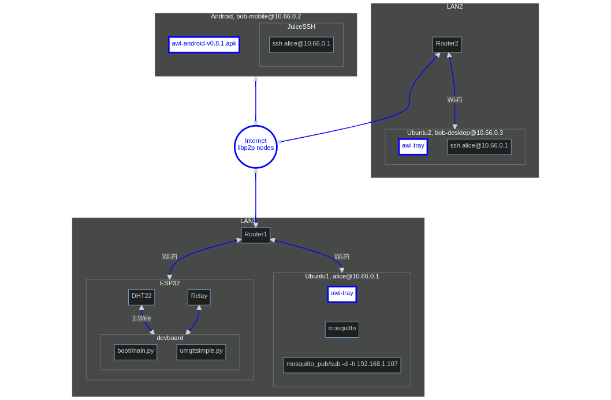

> “...the bullshit piled up so fast... you needed wings to stay above it.”<br> &ndash; Apocalypse Now, 1979

<table align="center">
    <tr>
    <th align="center"> The ESP32 as the MQTT Client</th>
    </tr>
    <tr>
    <td>
    
    </td>
    </tr>
</table>

## Introduction

[DOIT DEvKit V1 ESP32-WROOM-32](https://en.wikipedia.org/wiki/ESP32) is an inexpensive (15 euro) microcontroller board with Wi-Fi, Bluetooth LE, and ESP-NOW. One can connect it to [a lot of sensors](https://esphome.io/#sensor-components) with ready-made drivers. The challenge is to control such a board globally, via the internet.

Initially, the goal was to use the ESP32 board for remote plant watering. This goal was achieved. However, we also found code-free solutions based on the Clas Ohlson WiFi Smart Plug which could be dissected and controlled with their mobile app. The latter are cheap (10-20 euro) and easy to use, but one must rely on the Clas Ohlson servers. Smart plugs are limited: It is a one way communication from a mobile phone to an electrical relay via 3rd party servers.

The ideal is reliable developer-friendly Linux-centric global open free communication.

## ESP32 and IoT

There are several ways to connect the ESP32 globally:

1. Cloud services: [ESP RainMaker](https://github.com/espressif/esp-rainmaker/issues/96), [Firebase](https://randomnerdtutorials.com/firebase-control-esp32-gpios/), [Blynk](https://blynk.io/blog/esp32-blynk-iot-platform-for-your-connected-product), [Arduino IoT Cloud](https://www.youtube.com/watch?v=rcCxGcRwCVk), [Yaler.net](https://yaler.net/), [Amazon API Gateway with Websocket API](https://www.youtube.com/watch?v=z53MkVFOnIo), [Amazon API Gateway with RESTful API](https://aws.amazon.com/blogs/compute/building-an-aws-iot-core-device-using-aws-serverless-and-an-esp32/), [Husarnet](https://husarnet.com/docs/tutorial-esp32-platformio), [CloudMQTT](https://www.cloudmqtt.com/blog/cloudmqtt-cute-cat-free-plan-out-of-stock.html), [HiveMQ](https://community.hivemq.com/t/connection-fail-in-hivemq-cloud/579/4), [RemoteXY](https://www.youtube.com/watch?v=dyEnOyQS1w8&t=1s), [Google Cloud IoT](https://www.elementzonline.com/blog/Connecting-ESP32-to-Google-Cloud-IoT), Viper/Zerynth: [1](https://zerynth.com/blog/python-on-esp32-getting-started/), [2](https://lemariva.com/blog/2021/12/zerynth-esp32-google-iot-core-part-1-sending-data-to-the-cloud), [3](https://zerynth.com/customers/case-studies/zerynth-powered-smart-iot-display/)... 

    Google IoT Core [will be discontinued on August 16, 2023](https://news.ycombinator.com/item?id=32475298). [Free plans come and go](https://twitter.com/heroku/status/1562817050565054469). Husarnet is the only one from the listed above which provides [its open source code](https://husarnet.com/business/open-source).
    
2. Classical web apps which will communicate with the ESP32 via the HTTP requests: [1](https://randomnerdtutorials.com/control-esp32-esp8266-gpios-from-anywhere/), [2](https://randomnerdtutorials.com/esp32-esp8266-mysql-database-php/). Notice that the board needs to know the URL or the IP address of the web app to send GET/POST requests, but the web app does not need to know the address of the board.

3. Something similar, but with the MQTT replacing the HTTP. Again, only the board needs to know the URL or the IP address of the "MQTT app". The MQTT is preferable for two reasons: (i) the MQTT client libs are more reliable than their HTTP counterparts in the ESP world, and (ii) there is no need to write a web app to send/receive data. One can simply run the Mosquitto broker as an "MQTT app" and use "mosquitto_pub/sub" commands w.r.t. the MQTT topics that the board will pub/sub to.

4. Connecting the ESP32 to the Linux PC over Wi-Fi that runs the MQTT broker within its LAN, thus delegating the problem of global connectivity effectively to the PC space.

The last option is my choice. It is the most reliable one, but it demands an extra PC/Linux board (PC-1 shown in the figure above). 

One can run the MQTT broker on a router, e.g. with [OpenWrt Linux](https://cgomesu.com/blog/Mesh-networking-openwrt-batman/): [1](https://www.onetransistor.eu/2019/05/run-local-mqtt-broker-on-openwrt-router.html), [2](https://esp8266.ru/esp8266-openwrt-mosquitto-mqttwarn-thingspeak-email-android-ios-twitter-cloudmqtt/) or [RutOS](https://teltonika-networks.com/lt/resursai/webinarai/rutos-an-extensive-introduction), but these router OSes (6-8MB .bin image size) are too limiting.

In order to establish remote PC connections, we have tested [Hyprspace](https://github.com/hyprspace/hyprspace/issues/94), [EdgeVPN](https://github.com/mudler/edgevpn/issues/25), and [awl](https://github.com/anywherelan/awl). All of them are built on top of [go-libp2p](https://github.com/libp2p/go-libp2p) which is both, the FOSS code, and the actual running network with the focus on a [NAT](https://discuss.libp2p.io/t/how-nat-traversal-and-hole-punching-work-in-ipfs/1422) [traversal](https://github.com/ipfs/camp/blob/master/DEEP_DIVES/40-better-nat-traversal-so-that-relay-servers-are-a-last-not-first-resort.md). This stack is very useful for the ability to ssh into a remote computer without a public static IP.

According to [Max Inden, 2022](https://archive.fosdem.org/2022/schedule/event/libp2p/attachments/audio/4917/export/events/attachments/libp2p/audio/4917/slides.pdf), the libp2p network "powers the IPFS, [Ethereum 2](https://blog.libp2p.io/libp2p-and-ethereum/#how-ethereum-beacon-nodes-use-libp2p-%F0%9F%94%8D), Filecoin and Polkadot network and there are ~100K libp2p based nodes online at any given time".

Do these tools always work though, are they equally good? 

    [hyprspace](https://github.com/hyprspace/hyprspace): 895 LOC of Go. Minimal, but weaker hole punching.
  
    [awl](https://github.com/anywherelan/awl): 6.5 KLOC of Go. Just about right.
  
    [EdgeVPN](https://github.com/mudler/edgevpn): 7.5 KLOC of Go. Solid punching, but problems with 24/7 runs. No Android support. 

    [go-libp2p](https://github.com/libp2p/go-libp2p): 67 KLOC of Go. The base layer for the three above.
  
    [Syncthing](https://github.com/syncthing/syncthing/tree/main): 110 KLOC of Go, 37.5 KLOC of Js, 10.6 KLOC of CSS. Irrelevant here, but this is what it takes to sync a folder.


EdgeVPN may have an [edge](https://github.com/mudler/edgevpn/issues/25) over Hyprspace, but there is [a problem with long runs](https://github.com/mudler/edgevpn/issues/137). [awl](https://github.com/anywherelan/awl) is more reliable and also more convenient (desktop browser GUI for one-click handshakes, runs on Android).

## P2P vs. Cloud

[awl](https://github.com/anywherelan/awl) solves the problem of remote connections without a public IP/3rd party. However, hole punching is not always guaranteed, and the libp2p connections will not be the fastest possible. Therefore, it is good to keep an eye on other ways, though to be honest the cloud seems to be a goner.

- Renting any VPS with a public static IP and running WireGuard: [1](https://www.youtube.com/watch?v=SMF301vQqJo), [2](https://www.youtube.com/watch?v=5Aql0V-ta8A), [3](https://www.youtube.com/watch?v=_hiYI7ABnQI) or any of its alternatives with self-hosting: Nebula, Headscale, innernet, openp2p.cn, Tinc, [VpnCloud](https://vpncloud.ddswd.de/), [Outline VPN](https://www.youtube.com/watch?v=O9jGg6tE7nY)... 

    The VpnCloud website is [very educational with useful comparisons](https://vpncloud.ddswd.de/features/comparison/).
    
    [openp2p.cn](https://github.com/openp2p-cn/openp2p) provides the VPN code and access to their server for free. This completely solves the problem, if you trust the server. 
    
    Outline VPN is based on [shadowsocks](https://www.quora.com/How-do-I-bypass-the-GFW-of-China-without-a-VPN), the tech used to bypass [the Great Firewall of China](https://en.wikipedia.org/wiki/Great_Firewall):

    "the developer of shadowsocksR being asked to police station,the code on github was deleted by unimagable mean. so v2ray come out in the world. Which is stronger than shadowsocks (or in another way v2ray contains shadowsocks),the establish method is same with shadowsocks.U can search 一键搭建v2ray on YouTube..."

- This is quite an M.Sc. thesis:

    ["Design and Implementation of SoftEther VPN" by Daiyuu Nobori, Univ. of Tsukuba, Japan. 2013.](https://www.softether.org/4-docs/9-research/Design_and_Implementation_of_SoftEther_VPN)

    A lot of protocols and acronyms. [396,867 LOC in C++. 10.3K Github stars, over 1K issues.](https://github.com/SoftEtherVPN/SoftEtherVPN).
    
- Tailscale and related Connectivity-as-a-Service (CaaS) clouds: Defined Networking, NetBird, Netmaker, [ZeroTier](https://www.youtube.com/watch?v=sA55fcuJSQQ), [Hamachi](https://news.ycombinator.com/item?id=29479503), Tunnel In, [Cloudflare Tunnel](https://developers.cloudflare.com/cloudflare-one/connections/connect-apps/)... More (IoT/Raspberry Pi/Linux)-centric CaaS: ShellHub, RemoteIoT, DataPlicity, PiTunnel, SocketXP, NetFoundry: [1](https://netfoundry.io/edge-and-iot-zero-trust-networking/), [2](https://www.reddit.com/r/openziti/comments/xpe01b/need_some_guidance/)... Vendor lock-in.

- Remmina, Chrome Remote Desktop, TeamViewer, AnyDesk, RustDesk, [Screego](https://github.com/screego/server)... Remmina does not punch through CGNAT. Others are either paid services or rely on a static IP. [Parsec, Rainway, Steam Remote Play](https://news.ycombinator.com/item?id=29479503) and other paid game streaming services might provide the most responsive VPNs. "UbuntuDesk" with a free CGNAT punching, please. 

    Remmina works well on Ubuntu 22.04 with the VNC protocol and the VPN addresses such as those of [awl](https://github.com/anywherelan/awl).

- Wireguard on the ESP32: [1](https://github.com/ciniml/WireGuard-ESP32-Arduino), [2](https://github.com/trombik/esp_wireguard), [3](https://github.com/esphome/feature-requests/issues/1444). This is for some overly optimistic uses where the ESP32 becomes an independent node on a par with Linux boards. Wireguard needs a public static IP.

- The Onion Router: [1](https://www.maths.tcd.ie/~fionn/misc/ssh_hidden_service/), [2](https://www.techjail.net/raspberry-iotlinux-devices.html), [3](https://golb.hplar.ch/2019/01/expose-server-tor.html), [4](https://community.torproject.org/onion-services/setup/), [5](https://www.reddit.com/r/Freenet/comments/9w4do9/demo_public_darknet_on_the_tor_onioncat_ipv6/), [6](https://null-byte.wonderhowto.com/how-to/host-your-own-tor-hidden-service-with-custom-onion-address-0180159/), [7](https://opensource.com/article/19/8/how-create-vanity-tor-onion-address), [8](https://shufflingbytes.com/posts/ripping-off-professional-criminals-by-fermenting-onions-phishing-darknet-users-for-bitcoins/).
 
    "It's easier to setup a Tor hidden service than it is to set up a server with a domain. You don't have to know anything about DNS or firewalls. I'm surprised that they aren't more common."
  
    "The most popular method for pairing Tor & VPN is by connecting to a VPN server first, then using the Tor Browser. With the 'Tor over VPN' method, your real IP address is hidden from your Tor entry node. Moreover, your ISP won't know you're using Tor. This is the easier Tor VPN configuration to achieve of the two."

- weron: [1](https://news.ycombinator.com/item?id=31297917), [2](https://www.reddit.com/r/golang/comments/ukm5a2/weron_a_peertopeer_vpn_based_on_webrtc_written_in/), [3](https://github.com/pojntfx/weron#usage). One still needs to host a so called signaling server, "while it is possible and reasonably private (in addition to TLS, connection information is encrypted using the --key flag of clients) to use the hosted signaling server at wss://weron.up.railway.app/".

- Yggdrasil: [1](https://news.ycombinator.com/item?id=27580995), [2](https://cheapskatesguide.org/articles/yggdrasil.html), [CJDNS](https://news.ycombinator.com/item?id=16135341)/Hyperboria, ZeroNet, I2P, n2n: [1](https://news.ycombinator.com/item?id=31297917), [2](https://github.com/ntop/n2n/issues/1058), nnet (the NKN blockchain): [1](https://nkn.org/community/blog/introducing-nnet/), [2](https://github.com/nknorg/nnet), Secure Scuttlebutt, [Spacemesh](https://platform.spacemesh.io/docs/next/protocol/p2p/overview/), [Hyperswarm](https://news.ycombinator.com/item?id=18077538), Ethereum devp2p: [1](https://github.com/ethereum/devp2p), [2](https://www.reddit.com/r/ethdev/comments/ul8dck/how_does_an_ethereum_transaction_work_at_the/), [3](https://github.com/memo/eco-nft), [4](https://blog.libp2p.io/libp2p-and-ethereum/#how-ethereum-beacon-nodes-use-libp2p-%F0%9F%94%8D) and other global p2p network stacks. 

    No doubt these are some outstanding highly ambitious community projects. At the lowest level, one would be interested to know: (i) hole-punching success probability, (ii) average connection speed, and (iii) scaling as the number of nodes increases. Perhaps this is too much to ask. Focus on go-libp2p, or even [Ethereum 2.0](https://blog.libp2p.io/libp2p-and-ethereum/)?!

## Some Photos

This hobby/demo hardware has been assembled and soldered by Saulius Rakauskas (InfoVega).


## Circuit Diagram

- [esp32-30pin] (the 30-pin variant of DOIT DEVIT V1 ESP32-WROOM-32, not 36).

- DHT22, Multiple LEDs, Capacitive Soil Moisture Sensor v1.2, see boot.py.

- ~~SSD1306 with in-software I2C.~~ Dropped it, rewind to "the last before revamp" commit if interested.

## Commands

- Ubuntu PC:

  ```console
  sudo apt-get install python3-pip
  sudo pip3 install esptool
  sudo pip3 install rshell
  ```

- USB connection:

  ```console
  ls /dev/ttyUSB*
  dmesg | grep ttyUSB
  ```

- Flashing/reflashing [MicroPython firmware][MicroPython firmware] via USB:

  ```console
  sudo esptool.py --port /dev/ttyUSB0 flash_id
  sudo esptool.py --port /dev/ttyUSB0 erase_flash
  sudo esptool.py --chip esp32 --port /dev/ttyUSB0 --baud 460800 write_flash -z 0x1000 esp32-ota-20220618-v1.19.1.bin
  ```  

- Release: 

  ```console
  rshell --buffer-size=30 -p /dev/ttyUSB0 -a
  boards
  ls /pyboard
  cp main.py /pyboard
  cp umqttsimple.py /pyboard
  cp boot.py /pyboard
  ```

  Disconnect the device from USB and use only a power supply.

- MQTT:

  ```console
  sudo apt install mosquitto mosquitto-clients
  hostname -I
  ifconfig -a | grep inet
  ```

  The hostname/ifconfig command will provide the local IP address assigned by the router to a computer (PC-1) which runs the MQTT broker (Moscquitto), such as '192.168.1.107'. It will have to be entered in boot.py manually/explicitly. 


  The Mosquitto broker always runs on Ubuntu by default once the OS starts. However, depending on the exact Ubuntu and Mosquitto versions one may need some additional minimal configuration.
  Since Mosquitto version 2.0, one needs to create a custom config file and place it somewhere, say at /home/sara/esp32/custom_mosquitto.conf, with this minimal content:

  ```console
  listener 1883
  allow_anonymous true
  ```
  
  Then start the MQTT broker with this config:

  ```console
  mosquitto -c /home/sara/esp32/custom_mosquitto.conf
  ```

  Sometimes you may get "Error: Address already in use". That means you are starting another Mosquitto broker on the same machine. Kill one or the other with
    
  ```console
  ps -ef | grep mosquitto
  sudo kill 1234
  ```
    
  One should get the console message indicating the connected MicroPython MQTT client with its local IP address such as 192.168.1.108, the latter may change 
  with each device reboot, it is assigned by a router.

  Read the sensor data from the device:
 
  ```console
  mosquitto_sub -d -h 192.168.1.107 -t "testincr"
  ```

  Publish the messages "on" or "off" to control the LED output:

  ```console
  mosquitto_pub -d -h 192.168.1.107 -t "output" -m "on" -q 1
  mosquitto_pub -d -h 192.168.1.107 -t "output" -m "off" -q 1
  ```

- EdgeVPN:

  Download the latest edgevpn executable for your OS, e.g. [edgevpn-v0.23.1-Linux-x86_64.tar.gz](https://github.com/mudler/edgevpn/releases/tag/v0.23.1). 
  
  Use the same release version on all the computers that will be connected into a VPN, otherwise there might be conflicts as some versions have changed the way the keys are stored and decoded.
  
  cd into extracted folder and generate config.yaml:
  
  ```console
  ./edgevpn -g > config.yaml
  ```

  Distribute it on all the machines that will be connected to EdgeVPN (manually by carrying a USB stick, via email, etc.).
  
  Assuming the machine runs Ubuntu, place the executable with config.yaml in the same folder and run
  
  ```console
  sudo IFACE=edgevpn0 ADDRESS=10.1.0.7/24 EDGEVPNCONFIG=config.yaml ./edgevpn --log-level debug
  ```
  
  The command assigns a virtual IP address 10.1.0.7 to the machine on which it is executed. Assign a different address to each machine that you connect to EdgeVPN, i.e. 10.1.0.1.. 10.1.0.254. but use the same config.yaml in each case.
  
  It may take several minutes for the node to join the EdgeVPN network which is the libp2p network under the hood. [The Linux desktop GUI](https://github.com/mudler/edgevpn-gui) is totally unnecessary.
  
  If everything is fine, you should be able to connect to any Linux computer of your VPN, e.g.
  
  ```console
  ssh username@10.1.0.8
  username@10.1.0.8's password: 
  Last login: Mon Jul 10 15:13:34 2023 from 10.1.0.4
  
  ...
  
  exit
  logout
  Connection to 10.1.0.8 closed.
  ```
    
  When you are able to connect from A to B, A's ./edgevpn --log-level debug will show a lot of information including the following lines:
  
  ```
  {"level":"DEBUG","time":"2023-07-11T14:44:39.455+0300","caller":"discovery/dht.go:204","message":" Announcing ourselves..."}
  {"level":"DEBUG","time":"2023-07-11T14:44:56.542+0300","caller":"discovery/dht.go:207","message":" Successfully announced!"}
  {"level":"DEBUG","time":"2023-07-11T14:44:56.542+0300","caller":"discovery/dht.go:210","message":" Searching for other peers..."}
  {"level":"DEBUG","time":"2023-07-11T14:44:56.583+0300","caller":"discovery/dht.go:230","message":" Known peer (already connected):
  ```
  
  followed by the list of so called multiaddresses of known/connected peers which will include global or local IPv4. While being on the A side, you should be able to see the local LAN IPv4 address of B assigned to B by its encompassing router on the B side!
  
- awl:
  
  There is [one unsolved issue](https://github.com/mudler/edgevpn/issues/137) with edgevpn that occurs on the 24/7 runs, so we switched to [awl](https://github.com/anywherelan/awl) which seems to be more reliable. 
  
  Download the [awl-tray binary](https://github.com/anywherelan/awl/releases) and run it, see [1](https://github.com/anywherelan/awl#desktopandroid) and [2](https://github.com/anywherelan/awl#desktop-awl-tray) for more details.
  
  awl is nice in that once you start it on Android, you can then run an SSH app such as [JuiceSSH](https://play.google.com/store/apps/details?id=com.sonelli.juicessh&hl=en&gl=US) and get a remote access to your Linux terminal. Make sure the VPN by awl has no overlapping/duplicated addresses and delete all the previous connections on JuiceSSH before connecting. awl is not very polished yet so you can sometimes mess up virtual addresses with many-to-one connections or loops, but these situations are avoidable more or less.
  
  For Ubuntu 22.04 to Ubuntu 22.04 Remmina with VNC works on the awl addresses pretty much without any extra configuration, so one gets a remote desktop control for free this way. 
  If older versions of Ubuntu, firewalls, Windows and RDP are involved, Remmina starts losing her charm, the SSH is more reliable.
   
## ESP32 and MicroPython

- **Hardware errors.** When the DHT sensor is detached from the chip's pin, executing the line "dht_sensor.measure()" or "dht_sensor.start()" 
  in the MicroPython REPL will reboot the device with a "useful" error message:

  ```console
  >>> import main
  ets Jun  8 2016 00:22:57

  rst:0x8 (TG1WDT_SYS_RESET),boot:0x13 (SPI_FAST_FLASH_BOOT)
  configsip: 0, SPIWP:0xee
  clk_drv:0x00,q_drv:0x00,d_drv:0x00,cs0_drv:0x00,hd_drv:0x00,wp_drv:0x00
  mode:DIO, clock div:2
  load:0x3fff0030,len:4540
  ho 0 tail 12 room 4
  load:0x40078000,len:12448
  load:0x40080400,len:4124
  entry 0x40080680
  W (57) boot.esp32: PRO CPU has been reset by WDT.
  W (58) boot.esp32: WDT reset info: PRO CPU PC=0x400803c0
  W (59) boot.esp32: WDT reset info: APP CPU PC=0x40093cb2
  MicroPython v1.17 on 2022-01-10; 4MB/OTA module with ESP32
  Type "help()" for more information.
  >>> 
  ```
- **Too little RAM.** ESP12e/ESP8266 has a [pathetic amount of RAM](https://github.com/espressif/esp-rainmaker/issues/8), but ESP32 is no cake either. Importing the font arial35 from Peter Hinch's ssd1306 lib along with freesans20 
  is still possible when running the DHT measurement with the display without the networking stack. Adding the async networking and the MQTT libs exposes an 
  insufficient RAM: 
  
  ```console
  "MemoryError: memory allocation failed, allocating 6632 bytes" (breaks at "#import gui.fonts.arial35 as arial35").
  ```
- **Low quality sensors**, see e.g. this [discussion](https://www.youtube.com/watch?v=IGP38bz-K48) of Capacitive Soil Moisture Sensor v1.2.
  The solutions based on the electrical resistance are worse due to a rapid corrosion of the electrodes. Contrary to some existing recommendations, submerging them into a cheap construction-site gypsum does not work as this kills their moisture sensitivity.
  
- Monitoring soil moisture is a much harder problem than sensing air humidity. Perhaps the best way is to set up a camera and observe the ground surface. It is doubtful whether the ESP32 could be a good platform for capturing and sending images.     
  
- Despite all the amazing work by Peter Hinch, the device could only send the MQTT messages, the receiving did not work.

- After a long search and disappointment the resilience w.r.t. the Wi-Fi loss was reached thanks to this [code by Rui and Sara Santos][micropython-Rui-Santos].
  
## Conclusions

The ESP32: Is it really that useful?!

- The [ESP32](https://en.wikipedia.org/wiki/ESP32) is better than sending UDP packets with [Atmega and the ENC28J60](http://tuxgraphics.org/electronics/200606/article06061.shtml). However, tiny RAM = obscure evolving software and yet another community fracturing, limited global connectivity options. The ESP32 niche is about distributing the [ESP32-ready sensors](https://esphome.io/#sensor-components) within a LAN:

    1. [Waste bin level detectors based on ultrasonic distance sensors](https://www.ecubelabs.com/bin-level-sensors-5-reasons-why-every-city-should-track-their-waste-bins-remotely/)?

    2. A bus card reader? We used to have some early low RAM devices here in Vilnius for about 5-10 years. This year (2023) the bus card readers got replaced with Estonian Ridango devices which, I suspect, run Linux.
    
    3. Mapping out minefields? See [1](https://youtu.be/suxLa6kWsrw?t=2000) and [2](https://cepdnaclk.github.io/e17-3yp-Landmine-Detector/) for two completely different systems. The first one presents a radar mounted on a drone, while the second one is a Colpitts oscillator-based metal detector on a four-wheel robot. 

- A few more useful applications (these do not even require Wi-Fi connectivity):

    4. [The GPS Tracker](https://how2electronics.com/esp32-gps-tracker-using-l86-gps-module-oled-display/).

    5. [Azra Anjum et. al. Real Time IOT based Non-invasive Glucobin Monitor for Diabetes
    Patients, 2021](https://ijrpr.com/uploads/V2ISSUE9/IJRPR1274.pdf)
    
        [Chuchart Pintavirooj et. al. Noninvasive Portable Hemoglobin Concentration Monitoring System Using Optical Sensor for Anemia Disease, 2021](https://www.ncbi.nlm.nih.gov/pmc/articles/PMC8230267/)
    
        Both works pair the ESP32 with inexpensive LED-photodiode-based sensors to measure the blood glucose or hemoglobin concentration non-invasively. See also [Aminah Hina and Wala Saadeh. Noninvasive Blood Glucose Monitoring Systems Using Near-Infrared Technology—A Review, 2022](https://www.mdpi.com/1424-8220/22/13/4855).
 
    6. [A smart walking cane for the blind](https://github.com/manishmeganathan/smartwalkingcane).    
    
- Wi-Fi is limited to 10...50m without repeaters. [LoRa](https://en.wikipedia.org/wiki/LoRa) may reach [1...166km](https://meshtastic.discourse.group/t/practical-range-test-results/692/47?page=2). One can use a complete [LILYGO TTGO T-Beam ESP32 board](https://www.youtube.com/watch?v=TY6m6fS8bxU) or connect the LoRa shield bridge to ATmega first and then to the PC, or connect the shield bridge directly to the Raspberry Pi boards, see [this LoRa for libp2p example](https://github.com/RTradeLtd/libp2p-lora-transport). [Mobile radio network uses](https://meshtastic.discourse.group/t/real-world-use-cases/175) are very demanding w.r.t. power consumption. The ESP32 could be suboptimal here.

Global Connectivity

- All this gigantic VPN activity exists mostly because A and B do not have proper addresses. We cannot use MAC, we do not have the IPv6. So how does one send a message? Expect to have to deal with the OSI model, overlay mesh networks, proxies and reverse proxies, [tunneling and self-hosting](https://github.com/anderspitman/awesome-tunneling), STUN/TURN/ICE, TCP meltdown, CGNAT, SOCKS5, ARP, ICMP, subnet masks, CIDR, gateways, port forwarding, host names, DNS and mDNS, DHCP, virtual interfaces, firewalls, Linux kernel routes, routers and routing...

- We do connect A and B, and it is finally free, but there is still no 100% guarantee. [More like 50% - 80%](https://www.youtube.com/watch?v=bzL7Y1wYth8). The complexity is staggering. 70+ KLOC of Go just to give your computer a proper global address so that you can ssh or use Remmina. Syncing a folder? Double these 70+ thousand lines of code.

- Some pretty basic services are very complex underneath. Humanity has not yet automated elections, though there is a certain [progress](https://hackmd.io/@juincc/B1QV5NN5S).

- Code atop go-libp2p to peek into: EdgeVPN, Hyprspace, [awl](https://github.com/anywherelan/awl), Syncthing: [1](https://www.reddit.com/r/Syncthing/comments/1324xrm/how_reliable_is_synthing/), [2](https://forum.syncthing.net/t/how-syncthing-communicates-with-my-server-when-im-in-a-public-network/20437/2). [safe-network](https://github.com/maidsafe/safe_network) atop rust-libp2p.

## References

The ESP32 Essentials:

- [MicroPython firmware]
- [micropython-Rui-Santos]
- [umqtt.simple]
- [esp32-30pin]

Optional (problems to be aware of):

- [micropython-mqtt-async]
- [micropython-nano-gui]
- [umqtt.robust]
- [umqtt.robust dies when MQTT broker gets restarted #102]
- [umqtt.simple socket behaviour when WiFi is degraded #103]
- [umqtt.robust: Resubscribe to topics after doing reconnect. #186]
- [can't await mqtt.simple publish method #357]
- [unstable MQTT on ESP8266 (4+ days) #2568]
- [umqtt cannot import MQTTClient #250]


[Getting Started]: https://www.youtube.com/watch?v=_vcQTyLU1WY&list=PLKGiH5V9SS1hUz5Jh_35oTFM4wPZYA4sT&index=2
[MicroPython firmware]: https://micropython.org/download/esp32-ota/
[micropython-mqtt-async]: https://github.com/peterhinch/micropython-mqtt/tree/master/mqtt_as
[micropython-nano-gui]: https://github.com/peterhinch/micropython-nano-gui
[micropython-Rui-Santos]: https://github.com/RuiSantosdotme/ESP-MicroPython/tree/master/code/MQTT/Node_RED_Client
[umqtt.simple]: https://github.com/micropython/micropython-lib/blob/master/micropython/umqtt.simple/example_sub_led.py
[esp32-30pin]:https://www.mischianti.org/wp-content/uploads/2020/11/ESP32-DOIT-DEV-KIT-v1-pinout-mischianti.png
[umqtt.robust]: https://github.com/micropython/micropython-lib/blob/master/micropython/umqtt.robust/example_sub_robust.py
[umqtt.robust dies when MQTT broker gets restarted #102]: https://github.com/micropython/micropython-lib/issues/102
[umqtt.robust: Resubscribe to topics after doing reconnect. #186]: https://github.com/micropython/micropython-lib/pull/186
[can't await mqtt.simple publish method #357]: https://github.com/micropython/micropython-lib/issues/357
[umqtt.simple socket behaviour when WiFi is degraded #103]: https://github.com/micropython/micropython-lib/issues/103
[unstable MQTT on ESP8266 (4+ days) #2568]: https://github.com/micropython/micropython/issues/2568
[umqtt cannot import MQTTClient #250]: https://github.com/micropython/micropython-lib/issues/250
